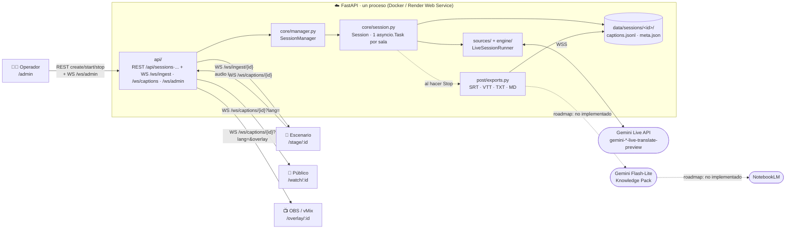
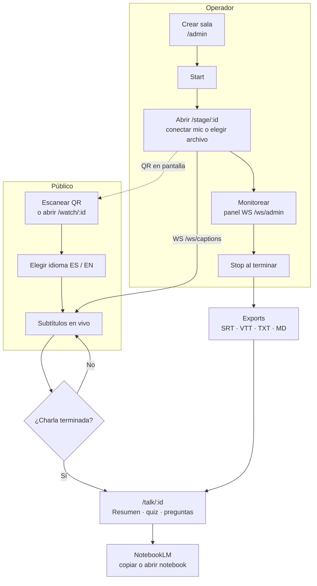

# Piluso Live Captions

Subtítulos y traducción EN ↔ ES en vivo para conferencias, con Gemini Live (free tier, costo cero). Una sala = una sesión Live que devuelve el original y la traducción; la audiencia elige sala e idioma desde el celular, con overlay listo para OBS/vMix y descargas de la transcripción al terminar.

*(Captura o GIF pendiente — ver [T3.12](backend/docs/TASKS.md).)*

Estado: motor Camino 1 (`live_translate`) en producción, sesiones con pub/sub por idioma, WS de subtítulos, vista de escenario con QR, panel de operador con monitoreo y exports, overlay para switchers, página post-charla con Knowledge Pack (resumen, puntos clave, quiz), "Preguntale a la charla" y botón "Copiar para NotebookLM", y deploy en Render (Docker). El exporter automático a NotebookLM (notebook + podcast) es opcional: viene apagado y no requiere ninguna cuenta para desplegar (ver "Después de la charla" y [`backend/docs/TASKS.md`](backend/docs/TASKS.md)). Plan y decisiones de arquitectura: [`backend/docs/PLAN.md`](backend/docs/PLAN.md).

**Demo en vivo:** `https://<TU-SERVICIO>.onrender.com` — reemplazar por la URL real del servicio de Render antes de compartir (el free tier de Render duerme el servicio sin tráfico: la primera carga puede tardar ~30-50s en levantar).

## Probalo en 3 minutos

1. Abrí `https://<TU-SERVICIO>.onrender.com/admin.html`, entrá con el `ADMIN_TOKEN` del proyecto.
2. Creá una sala con fuente **Archivo (samples/)** apuntando a `samples/en_talk_3min.mp3`, arrancala.
3. Abrí la vista de audiencia (`https://<TU-SERVICIO>.onrender.com/?s=ID`) o el QR que muestra `stage.html` — los subtítulos en vivo aparecen enseguida.
4. Para correr tu propia instancia: forkeá el repo y seguí [Deploy en Render](#deploy-en-render) más abajo (~5 min, solo necesitás una `GEMINI_API_KEY` sin billing).

## Correr en local

**Con Docker** (no hace falta Python ni ffmpeg en el host):

```bash
cp .env.example .env            # GEMINI_API_KEY de un proyecto SIN billing
make docker-test                # tests
make docker-run                 # http://localhost:7860  (ENV_FILE=otra/ruta/.env para usar otro archivo)
```

**Con Python 3.12 + ffmpeg:**

```bash
python3 -m venv .venv && source .venv/bin/activate
pip install -r requirements.txt
cp .env.example .env
make dev                        # http://localhost:7860
make test
```

Sin API key: `ENGINE=replay` crea una sala "Demo" que reproduce [`samples/replay_demo.jsonl`](samples/replay_demo.jsonl) en loop. Con key: `DEMO_FILE=samples/en_talk_3min.mp3` crea y arranca una sala con ese archivo (hasta que exista la consola de operador, T2.9).

## CLI

```bash
python -m backend.main_cli samples/en_talk_3min.mp3 --lang en                 # EN -> ES
python -m backend.main_cli samples/es_talk_2min.mp3 --lang es                 # ES -> EN
python -m backend.main_cli samples/replay_demo.jsonl --engine replay          # sin API
python -m scripts.spike_live samples/en_talk_3min.mp3 --lang en               # mediciones T1.4
python -m scripts.spike_live samples/en_talk_3min.mp3 --lang en --loop --minutes 12
python -m scripts.live_probe --sessions 2 --trials 3                           # T2.10a: concurrencia, SDK crudo
python -m scripts.runner_probe samples/mp3/a.mp3:en samples/es_talk_2min.mp3:es  # T2.10a: con nuestro engine
```

En Docker: `docker run --rm --env-file .env nerdearla-captions python -m backend.main_cli samples/en_talk_3min.mp3 --lang en`.

## Arquitectura

Cada sala corre su propia tubería (una `asyncio.Task`), aislada del resto: si una falla no afecta a las demás. Todas comparten un único proceso FastAPI dentro de un container (Render free tier o Docker local). El frontend es una SPA React servida por el mismo FastAPI (`web/dist/`).



### Pipeline de ingesta

Camino que recorre el audio hasta convertirse en subtítulos. Solo el Camino 1 (`live_translate`) está implementado hoy; el Camino 2 queda en el código como stub.

```mermaid
flowchart LR
  subgraph FUENTE["Fuente de audio"]
    MIC["🎙️ Mic navegador<br/>getUserMedia → AudioWorklet<br/>PCM16 16kHz, frames de 100ms"]
    FILE["📁 FileSource<br/>mp3 → ffmpeg → PCM"]
  end

  WSI["WS /ws/ingest/{id}"]
  FQ["FrameQueue<br/>5 s, descarta lo más viejo"]
  RUN["LiveSessionRunner<br/>envía frames + maneja rotación (~9 min)"]

  MIC -->|"binario"| WSI --> FQ
  FILE --> FQ
  FQ --> RUN

  subgraph MOTOR["Camino 1 (activo) · ENGINE=live_translate"]
    GEM["Gemini Live<br/>transcribe + traduce en un solo call"]
  end

  subgraph C2["Camino 2 (no implementado) · stub"]
    G2["Gemini Transcribe Live"]
    AR["Argos<br/>traducción local"]
  end

  RUN <-->|"WSS, ring buffer 2.5s"| GEM
  RUN -.->|"no implementado"| G2 -.-> AR

  SEG["Segmenter<br/>deltas → interim / final"]
  DEDUPE["dedupe_overlap<br/>evita repetidos tras reconectar"]
  GLOS["Glossary<br/>reemplazos + mayúsculas"]
  EVT["CaptionEvent"]

  GEM --> SEG --> DEDUPE --> GLOS --> EVT
  AR -.-> EVT

  EVT --> HIST["Historial en memoria<br/>últimos 50 finales"]
  EVT --> JSONL[("captions.jsonl")]
  EVT --> SUB["Suscriptores por idioma<br/>WS /ws/captions/{id}?lang="]
```



### Flujo de uso

Desde que el operador crea la sala hasta que el público ve el resumen al terminar la charla.



Diagrama completo y alternativas evaluadas: [`backend/docs/PLAN.md` §2.4](backend/docs/PLAN.md#24-flujo-de-datos) y [`backend/docs/DIAGRAMS.md`](backend/docs/DIAGRAMS.md) (versión extendida, 11 diagramas).

**Decisión de caminos:** el proyecto usa el **Camino 1** (`ENGINE=live_translate`), el modelo `gemini-*-live-translate-preview` que transcribe y traduce en la misma llamada. El **Camino 2** (`transcribe_mt`: transcripción + traducción local con Argos) está en el código como fallback pero **no está implementado/probado** — ver `PLAN.md §2.1` para por qué se descartó como default (el free tier no sostiene el costo de dos modelos por sala).

## Cómo crear la API key sin billing

1. En [Google AI Studio](https://aistudio.google.com/), creá un **proyecto nuevo** (no reutilices uno que ya tenga billing habilitado).
2. Generá la API key desde ese proyecto y verificá en **AI Studio → Projects** que figure como **Free**.
3. Para chequear cuotas y límites de sesiones concurrentes: **AI Studio → Rate limits** (RPM, TPM, RPD y sesiones Live simultáneas). Google no publica el cupo real de sesiones Live por adelantado — medilo con `scripts/live_probe.py` (ver [Mediciones](#mediciones-t14)) antes de un evento grande.

## Deploy en Render

El proyecto corre como un **Docker Web Service** en [Render](https://render.com) (free tier), usando el `Dockerfile` del repo tal cual (multi-stage: build del frontend con Node + runtime Python 3.12, `uvicorn` escuchando en `0.0.0.0:7860`).

1. En Render: **New → Web Service**, conectar el repo de GitHub (fork o el original).
2. **Environment**: Docker (detecta el `Dockerfile` solo). Si Render pide un puerto explícito, usar `7860` (el que expone el `Dockerfile`).
3. **Environment Variables**: `GEMINI_API_KEY` (de un proyecto **sin billing**, ver más abajo) y `ADMIN_TOKEN` (cualquier string, protege la consola). Opcional: `DEMO_FILE=samples/en_talk_3min.mp3` para que arranque una sala demo sola.
4. Deploy. Render buildea la imagen y la levanta; el servicio queda en `https://<nombre-del-servicio>.onrender.com`.
5. Verificar con `GET https://<nombre-del-servicio>.onrender.com/healthz` → `{"ok": true, "engine": "live_translate"}`.

**Free tier de Render:** el servicio se duerme sin tráfico y tarda ~30-50s en volver a levantar con la primera request — normal, no es un error de deploy. No hay disco persistente entre reinicios (igual que en Spaces): `data/` (sesiones, exports) no sobrevive un redeploy o un sleep/wake.

## Variables de entorno

| Variable | Default | Descripción |
|---|---|---|
| `GEMINI_API_KEY` | — | Key de un proyecto **sin billing** |
| `ENGINE` | `live_translate` | `live_translate` (Camino 1) · `chunked` (fallback A) · `replay` · `transcribe_mt` (Camino 2, no implementado) |
| `ADMIN_TOKEN` | — | Protege consola, API admin e ingesta de audio (T2.5) |
| `DATA_DIR` | `./data` | Sesiones, uploads, cuota |
| `LIVE_TRANSLATE_MODEL` | `gemini-3.5-live-translate-preview` | Camino 1 |
| `TRANSCRIBE_MODEL` | `gemini-3.5-transcribe-live` | Camino 2 |
| `KP_MODEL` | `gemini-3.1-flash-lite` | Knowledge Pack, ask, pasada final |
| `MAX_CONCURRENT_LIVE` | `4` | Tope de sesiones Live abiertas en el proceso (medido y validado sin degradación hasta 2 simultáneas, ver [Mediciones](#mediciones-t14)) |
| `ROTATE_AFTER_S` | `540` | Rotación preventiva (9 min) |
| `QUOTA_LIVE_SESSIONS_PER_DAY` | `0` | Cupo diario (0 = no mostrar) |
| `NOTEBOOKLM_ENABLED` | `0` | Exporter automático no oficial (T3.9), opcional; requiere `WITH_NOTEBOOKLM=1` en el build |
| `WITH_NOTEBOOKLM` | `0` | Build arg: `1` instala `requirements-notebooklm.txt` en la imagen |
| `NOTEBOOKLM_AUTH_JSON` | — | Contenido de `storage_state.json` de `notebooklm login` con una **cuenta dedicada** (secret, lo lee la librería) |
| `NOTEBOOKLM_STORAGE_PATH` | — | Alternativa local: ruta a `storage_state.json` (vacío = perfil default) |
| `NOTEBOOKLM_AUDIO` · `NOTEBOOKLM_AUDIO_LANG` | `1` · `es` | Generar el podcast (Audio Overview) y en qué idioma |
| `ASK_RATE_LIMIT` · `ASK_RATE_WINDOW_S` | `5` · `600` | Preguntas por IP por ventana en "Preguntale a la charla" |
| `LOG_LEVEL` | `INFO` | |
| `SEGMENT_IDLE_S` | `2.0` | Segundos sin fragmentos que cierran un segmento (provisorio, ver Mediciones) |
| `GEMINI_MODEL` · `CHUNK_SECONDS` · `OVERLAP_SECONDS` | `gemini-2.5-flash` · `5` · `0.75` | Fallback A (`ENGINE=chunked`) |
| `REALTIME` | `1` | `0` = leer los archivos sin pacing de tiempo real |
| `REPLAY_FILE` | `samples/replay_demo.jsonl` | Eventos que reproduce `ENGINE=replay` |
| `DEMO_FILE` | — | Audio de la sala "Demo" que se crea al arrancar (motores con API) |
| `DEMO_LANG` | `en` | Idioma de la charla de `DEMO_FILE` |
| `DEMO_LOOP` | `0` | `1` = repetir `DEMO_FILE` (gasta cuota sin parar) |

## Fuentes de audio

El sistema tiene dos fuentes implementadas y probadas (`backend/sources/`), seleccionables por sala (`POST /api/sessions`, campo `source: "mic" | "file"` — no es una env var global):

- **`FileSource`** (`backend/sources/file_source.py`): lee un archivo (`samples/*.mp3`), lo normaliza con ffmpeg a PCM y lo pacea en tiempo real (o lo más rápido posible con `REALTIME=0`). Es la fuente para pruebas, demos y CI — no depende del micrófono ni de conexión estable.
- **`MicSource`** (`backend/sources/mic_source.py`): recibe PCM en vivo desde el browser vía `getUserMedia` + `AudioWorklet` (`js/pcm-worklet.js`, remuestreo a 16kHz) sobre `WS /ws/ingest/{id}`. Usarla desde `stage.html`, eligiendo fuente **Micrófono** al crear la sala.

**No existe una `YouTubeLiveSource`** en el código ni está diseñada en los docs de planificación (`backend/docs/PLAN.md`, `TASKS.md`) — solo se documenta lo opuesto: exportar la transcripción de una sala (vía `FileSource` sobre el audio de un video) para subirla como subtítulos a un video ya publicado en YouTube. Para usar un video de YouTube como fuente en vivo hoy, el camino real es descargar/extraer su audio a un archivo y correrlo con `FileSource` — no hay ingesta directa de un stream de YouTube.

## Operación en un evento

**Mic:** en la notebook que corre `stage.html`, conectá la placa/consola de audio como dispositivo de entrada de Chrome (o el mic de sala vía cable a la placa) y elegilo al crear la sala con fuente **Micrófono**. La captura usa `getUserMedia` con `echoCancellation`, `noiseSuppression` y `autoGainControl` en `false`: esos filtros degradan una señal que ya viene limpia de consola.

**Vista de escenario (`stage.html?s=ID&token=...`):** pantalla para mostrar frente al público — medidor de nivel de audio, estado de conexión, badge de latencia, subtítulos en pantalla completa y un **QR** (esquina inferior, generado client-side con `qrcode.js`) que apunta a `/?s=ID&lang=es` para que la audiencia lo escanee desde el celular.

**Panel de monitoreo (`/admin.html`):** entrando con el `ADMIN_TOKEN`, la consola de operador muestra la tabla de salas (crear/arrancar/parar/borrar, links a Escenario y Audiencia, y el selector de exports por sala — ver "Después de la charla") y un panel en vivo por WebSocket con uptime, estado del mic, silencio, latencia p50/p95, rotaciones/reconexiones/errores y oyentes conectados por sala.

**Overlay para OBS/vMix (T3.1):** `index.html` acepta parámetros extra para usarse como fuente de navegador en un switcher, quemando los subtítulos traducidos sobre el video en vivo:

```
https://<TU-SERVICIO>.onrender.com/?s=ID&lang=es&overlay=1&bg=transparent&size=L&lines=2
```

| Parámetro | Valores | Qué hace |
|---|---|---|
| `overlay=1` | — | Oculta la barra superior y deja solo el texto sobre fondo transparente/chroma |
| `bg` | `transparent` (default) · `green` | Fondo transparente o verde puro (`#00ff00`) para chroma key |
| `size` | `L` | Usa el tamaño de letra más grande disponible |
| `lines` | número (default `3`) | Cuántas líneas de subtítulo mostrar a la vez |

El texto se muestra en blanco con contorno negro (4 direcciones) para leerse sobre cualquier fondo de video.

- **OBS Studio:** agregar una fuente **Browser Source**, 1920×1080, con esa URL (tildar "Shutdown source when not visible" apagado para no perder la conexión del WS al cambiar de escena). Con `bg=transparent` la fuente ya sale sin fondo, sin necesidad de chroma key.
- **vMix:** agregar una entrada **Web Browser** con la misma URL y el tamaño de la escena (1920×1080); si vMix no soporta transparencia real en esa entrada, usar `bg=green` y aplicarle un filtro de chroma key verde.

## Después de la charla

**Exports (listo):** desde `/admin.html`, cada sala tiene en la tabla un selector de formato (SRT, VTT, TXT, MD) y de idioma, con un botón "Exportar" que descarga la transcripción. Sin UI, el mismo endpoint sirve directo:

```
GET /api/sessions/{id}/export.{srt,vtt,txt,md}?lang={en,es}
```

`md` incluye ambos idiomas en un solo documento; los demás formatos requieren `lang`. Es un endpoint público (sin token), pensado para compartir el link después de la charla.

**Knowledge Pack (listo, T3.4):** al parar una sala (o cuando el archivo termina), un pipeline en segundo plano hace una llamada a `KP_MODEL` con la transcripción entera y guarda `knowledge.json` junto a `meta.json`: resumen ES/EN, 5–8 puntos clave con su `[mm:ss]`, términos y un quiz de 5 preguntas. Nunca bloquea el Stop; el estado queda en `kp_status` (`pending → ready | error`). Ante un 429/503 de Gemini reintenta una vez a los 60 s. Si la transcripción tiene menos de 60 palabras no se genera (el modelo empieza a inventar). Desde la consola, "Generar/Regenerar resumen" lo vuelve a correr (útil en Render, que pierde `data/` al dormir).

**Página de la charla (listo, T3.5):** `/talk/:id` (el link "Ver resumen →" aparece en la vista de audiencia al terminar) muestra resumen y puntos clave con selector ES/EN, quiz interactivo, "Preguntale a la charla", NotebookLM y descargas. Mientras el resumen se genera hace polling cada 5 s.

**"Preguntale a la charla" (listo, T3.6):** `POST /api/sessions/{id}/ask` con `{"q": "..."}` (máx. 300 caracteres). Responde solo con la transcripción, en el idioma de la pregunta y citando `[mm:ss]`. Límite de 5 preguntas cada 10 min por IP (en memoria) y cache por pregunta normalizada; las respuestas cacheadas no consumen límite.

**NotebookLM, capa 3 (listo):** el botón "Copiar para NotebookLM" copia el MD (con el resumen arriba de la transcripción) y abre NotebookLM para pegarlo como fuente. Si el navegador no deja copiar, descarga el `.md`. NotebookLM no tiene API pública para cuentas personales, por eso este es el camino por defecto.

**NotebookLM, capa 2: notebook + podcast automáticos (opcional, apagado por defecto; T3.9).** El proyecto **no necesita ninguna cuenta Google** para funcionar: sin configurar nada, el deploy usa la capa 3. Quien despliegue su propia instancia puede activar además que, al parar cada sala, se cree solo un notebook "Nerdearla 2026 — <título>" con el MD como fuente, se intente hacer público y se genere el podcast. El link queda en `meta.json` (`notebooklm_url`) y la página muestra "Abrir notebook con podcast".

Usa [`notebooklm-py`](https://github.com/teng-lin/notebooklm-py), una librería **no oficial** (NotebookLM no tiene API pública para cuentas personales) que puede romperse en cualquier momento. Cualquier error solo se loguea: la charla, los exports y el Knowledge Pack no se ven afectados.

> ⚠️ **Usá una cuenta Google dedicada, nunca la personal.** La sesión que guarda `notebooklm login` son las cookies de **toda** la cuenta (Gmail, Drive, etc.), no un permiso limitado a NotebookLM. Si va como secret en la nube, cualquiera con acceso al panel o a una filtración tiene esa cuenta. Además, los notebooks públicos muestran al dueño, y la automatización no oficial puede hacer que Google marque la cuenta.

Cómo activarlo:

1. Crear una cuenta Google nueva solo para esto.
2. En local, iniciar sesión con esa cuenta y probar con una sala ya terminada:
   ```bash
   pip install -r requirements-notebooklm.txt "notebooklm-py[browser]"
   notebooklm login                                    # abre el navegador: entrar con la cuenta dedicada
   python -m scripts.notebooklm_export <session_id>    # --no-audio: más rápido; --save: guarda el link en meta.json
   ```
3. En Render, agregar las variables de entorno:
   - `WITH_NOTEBOOKLM=1`: instala la librería en el build.
   - `NOTEBOOKLM_ENABLED=1`.
   - `NOTEBOOKLM_AUTH_JSON`: el contenido de `~/.notebooklm/profiles/default/storage_state.json`, como secret.
   
   Con Docker a mano: `docker build --build-arg WITH_NOTEBOOKLM=1 .`.
4. Si la sesión vence (Google rota las cookies), repetir `notebooklm login` y actualizar el secret.

Alternativa sin cookies en la nube: dejar Render sin configurar y correr el paso 2 a mano después de cada charla.

## Self-host

Sin depender de un servicio cloud, en tu propia máquina/mini PC:

```bash
cp .env.example .env
make docker-run                 # http://localhost:7860
```

y exponerlo a internet con un túnel gratuito, por ejemplo **Cloudflare Tunnel** (`cloudflared tunnel --url http://localhost:7860`) apuntando al puerto del container.

Hoy el deploy es un único container Docker (sin base de datos: todo el estado vive en `data/` y en memoria del proceso); un `docker-compose.yml` dedicado para self-host está en el backlog (T3.10, pendiente) — mientras tanto, el comando de arriba alcanza para levantarlo solo.

## Probar con 2+ sesiones simultáneas

Cada sala corre en su propio `asyncio.Task` dentro del mismo proceso (`core/session.py` + `core/manager.py`) — no hay nada que levantar aparte para probar concurrencia:

- **Desde la consola:** `/admin.html`, crear dos salas (distinto `source_lang`, por ejemplo una EN y otra ES) y arrancar ambas; el panel en vivo (WS `/ws/admin`) muestra uptime/latencia/errores por sala. Si ya hay `MAX_CONCURRENT_LIVE` salas Live abiertas, el `Start` de una sala extra devuelve un error claro (`SessionManager`, `core/manager.py:121`) en vez de degradar todas.
- **Desde CLI, sin consola:** `python -m scripts.runner_probe samples/mp3/a.mp3:en samples/es_talk_2min.mp3:es` corre 2 salas con el engine real en un solo proceso y loguea fragmentos/latencia por sala (usado para medir la concurrencia real, ver [Mediciones](#mediciones-t14)).

## Cómo escalar

**Arquitectura actual:** 1 sesión Live = 1 `asyncio.Task` en un único proceso/container. El techo real no es de cómputo sino el cupo de sesiones Live simultáneas del proyecto de Google (no publicado — medilo en AI Studio → Rate limits y con `scripts/live_probe.py`). `MAX_CONCURRENT_LIVE` (default `4`, validado sin degradación hasta 2) hace que el `SessionManager` rechace el Start de una sala de más con un error claro.

**Caminos de escalado, en orden de qué tan implementados están:**

- **Más salas = más servicios:** un servicio de Render (o un container Docker) por grupo de salas, sin estado compartido entre ellos — funciona hoy, sin código nuevo.
- **Key por sala:** solo suma cupo real si cada key es de un proyecto de Google distinto (los límites son por proyecto, no por key) — revisar los términos de uso de Google antes de usar varias cuentas propias.
- **Motor híbrido por sala (diseñado, no implementado):** Gemini Live en N salas prioritarias + transcripción/traducción en el propio navegador (Web Speech API de Chrome + Translator API de Chrome) para el resto, a costo $0. Documentado en detalle en [`backend/docs/alternativas-sesiones/OPCIONES-ESCALADO.md`](backend/docs/alternativas-sesiones/OPCIONES-ESCALADO.md) (opción D, ~3h de trabajo estimado) — requiere elegir el engine por sala, algo que hoy `factory.py` no soporta (usa un único `ENGINE` global). **No está en el código todavía.**
- **N workers/containers:** repartir salas entre varios procesos/instancias detrás de un balanceador, en vez de un solo proceso — no implementado; es el paso natural si el motor híbrido no alcanza y hace falta más cómputo (no más cupo de Gemini).
- **Límites del free tier:** costo cero con varias salas en paralelo **no está garantizado** — a más concurrencia, más chance de degradación (ver Mediciones).
- **Modo 100% local (roadmap):** reemplazar Gemini Live por Whisper + Gemma/Argos corriendo en hardware propio — no implementado, es la salida para cuando el free tier no alcanza.

## Mediciones (T1.4)

Medido el 24/9/2026 con `gemini-3.5-live-translate-preview`: `samples/en_talk_3min.mp3` (EN → ES, 3 min y 10 min en loop) y `samples/es_talk_2min.mp3` (ES → EN). Herramienta: `scripts/spike_live.py` (log crudo en `data/spike/`, no se commitea). Las latencias usan un VAD por energía (−45 dBFS), así que son aproximadas.

| # | Pregunta | Resultado |
|---|---|---|
| 1 | Semántica de los fragmentos | **Delta**: cada mensaje trae solo el texto nuevo, con espacio inicial, y hay que concatenarlo (el segmentador ya lo hace). No llega `interim_input_transcription` y `finished` nunca vale `True`: los finales los arma el segmentador. |
| 2 | Cadencia y largo | ~1 mensaje/s por track (p50 1,0 s), ~13 caracteres (máx. 35). Además llegan audio traducido continuo (4 chunks/s, a tiempo real), `usage_metadata` y `session_resumption_update` (~1/s). |
| 3 | Latencia | Voz → primer fragmento del original: p50 0,5–0,6 s. Fin de voz → siguiente fragmento: p50 0,45–0,55 s. Traducción ES → EN: p50 0,6 s, sin huecos de más de 2 s. **Traducción EN → ES: arranca 0,2–0,5 s detrás del original, pero en la corrida de 10 min (casi siempre con otra sesión en paralelo, ver abajo) tuvo frenazos de 12 a 55 s seguidos de ráfagas y a los 10 min cubría el 84 % del texto. Sola, la corrida de 3 min terminó de traducir ~20 s después del final del audio.** Al final de cada segmento se suma el segmentador (puntuación o `SEGMENT_IDLE_S` sin fragmentos). |
| 4 | Glosario | Bien escritos: Unix, Windows, Emacs, Wayland, Go, Bell Labs, MIPS, Pentium, Greenfield. Mal: "UTF-8" → "UTF", "TCP/IP" → "TCP IP", "Brownfield" → "groundfield" (y una vez "Greenfield"). El Camino 1 no acepta vocabulario: el post-proceso corrige errores consistentes (`groundfield => Brownfield`, `TCP IP => TCP/IP`), pero no palabras que el modelo omite ni confusiones con otro término válido. |
| 5 | `SMART` vs `VERBATIM` | N/A (solo Camino 2) |
| 6 | Límite de sesión | La **conexión** dura ~10 min: `GoAway` a los **540,6 s (9:00)** con `time_left=50s`; si el cliente no cierra, el servidor corta a los **590,7 s** con `ConnectionClosedError 1008 (policy violation)`. La **sesión** solo de audio dura 15 min sin compresión (docs), y se puede **reanudar** en otra conexión con el handle de `session_resumption_update` (llegan ~1/s con `resumable: true`, válidos 2 h). Probado: reconexión con el handle en 1,3 s y el texto sigue sin repetir. La rotación de T2.1 se basa en eso. |

Otro dato: al terminar el audio, el modelo sigue mandando audio traducido ~15 s más; por eso el runner espera hasta 30 s antes de cerrar (`drain_max_s`).

**Concurrencia (probe T2.10a, `scripts/live_probe.py`: SDK crudo, un proceso, sin backend, 40 s por sesión):**

| Prueba | Resultado |
|---|---|
| 1 sesión, justo después de otras corridas (17:48, 17:51) | degradada: primer texto a 7 s y 13,5 s; 10 y 3 fragmentos (normal: ~36) |
| 1 sesión, tras ~3 min sin uso | normal: 36 fragmentos, primer texto a 4,5 s |
| 2 simultáneas × 3, enseguida de la anterior | en las 3, una normal (36) y la otra degradada (5–13 fragmentos, primer texto a 6–12 s) |
| 2 escalonadas 10 s, enseguida | la primera degradada **aun estando sola** los primeros 10 s; la segunda normal |
| **2 simultáneas tras 5 min sin uso** | **las dos normales** (36/36, primer texto a 4,1 y 5,1 s) |
| **Reanudación** (cerrar a mitad y reconectar con el handle) | **reconexión en 1,3 s, el texto sigue sin repetir ni perder contexto** |
| 1 sesión nueva enseguida de la reanudación | normal (36) |
| **2 salas con nuestro runner/engine** (`scripts/runner_probe.py`, EN + ES, un proceso, en frío) | **las dos normales**: primer texto a 4,1 y 3,3 s, ~8 msgs/s, 0 frames perdidos, callbacks ≤ 1,4 ms |

Lectura: el proyecto **sí sostiene 2 sesiones simultáneas**; lo que degrada a una de ellas es abrir sesiones nuevas cuando ya hubo varias en los minutos previos (¿cupo retenido por sesiones recién cerradas o límite de arranques?; el efecto se va en < 5 min). Consecuencias: rotar **reanudando** (T2.1), no abrir sesiones nuevas de más (el `SessionManager` rechaza el Start de una sala más allá de `MAX_CONCURRENT_LIVE`), y vigilar `runner.stats` para detectar una sesión que conecta pero responde lento. Falta confirmar el cupo en AI Studio → Rate limits.

**Segmentador:** el corte por silencio pasó de 1,2 s a **2,0 s** (`SEGMENT_IDLE_S`, provisorio). Reproduciendo sin red los fragmentos reales del spike EN (cadencia normal), los cortes por silencio bajan de 4 a 1 en el original y de 10 a 8 en la traducción, con la misma cantidad de finales (34 y ~25). Los finales cortos que quedan en la traducción ("Este," o "para") vienen de sus frenazos de más de 2 s: ningún corte fijo los evita.

## Muestras

| Archivo | Contenido |
|---|---|
| `samples/en_talk_3min.mp3` | "Interview with Rob Pike", 0:30–3:30 (EN) |
| `samples/es_talk_2min.mp3` | "Brownfield engineering", Nicolás Páez, completo (2:10) |
| `samples/replay_demo.jsonl` | 20 eventos escritos a mano (interim + final, EN y ES) |

Los originales van en `samples/mp3/` (ignorado por git).

## Privacidad

En el free tier, Google usa el contenido enviado para mejorar sus productos. Para charlas públicas es aceptable, pero hay que saberlo.

## Licencia y créditos

MIT. Piluso Live Captions, hecho para Nerdearla, con Gemini Live (Google AI Studio) como motor de transcripción y traducción.
