# Diagramas — Nerdearla Live Captions

> Diagramas en Mermaid: GitHub los renderiza directo en este archivo.
> Las versiones PNG están en `docs/diagrams/` (para Devpost, el video o slides).

## Índice

- [1. Contexto del sistema](#1-contexto-del-sistema)
- [2. Componentes del backend](#2-componentes-del-backend)
- [3. Pipeline de datos de una sala](#3-pipeline-de-datos-de-una-sala)
- [4. Secuencia: ciclo de vida de una charla](#4-secuencia-ciclo-de-vida-de-una-charla)
- [5. Secuencia: rotación de la sesión Live](#5-secuencia-rotación-de-la-sesión-live)
- [6. Estados de una sala](#6-estados-de-una-sala)
- [7. Flujo del público](#7-flujo-del-público)
- [8. Flujo del operador](#8-flujo-del-operador)
- [9. Despliegue](#9-despliegue)
- [10. Escalado a muchas salas](#10-escalado-a-muchas-salas)
- [11. Decisión de camino en H0](#11-decisión-de-camino-en-h0)

---

## 1. Contexto del sistema

Quién usa el sistema y con qué servicios externos habla. Muestra las tres conexiones WebSocket: **#1** audio del escenario al servidor, **#2** servidor ↔ Gemini Live (la maneja el SDK) y **#3** subtítulos hacia el público.

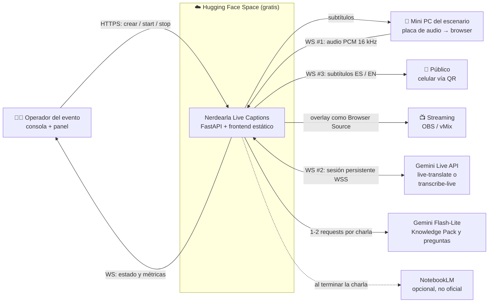

PNG: `docs/diagrams/01-contexto.png`

---

## 2. Componentes del backend

Módulos del repo y cómo se relacionan. El frontend es estático y lo sirve el mismo FastAPI; cada sala corre su propio pipeline dentro de una `asyncio.Task`.

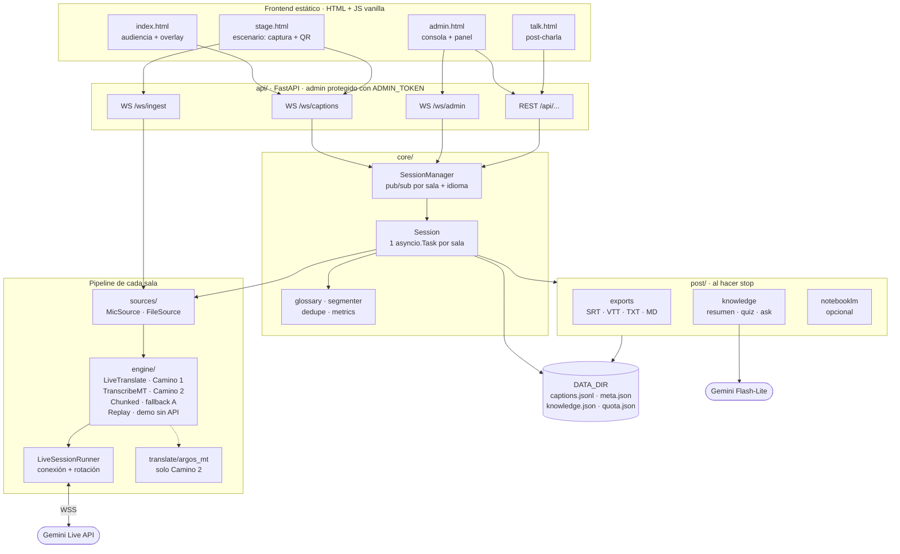

PNG: `docs/diagrams/02-componentes.png`

---

## 3. Pipeline de datos de una sala

Camino que recorre el audio hasta convertirse en subtítulos, con las dos variantes del motor. Solo uno de los dos caminos está activo según `ENGINE`.

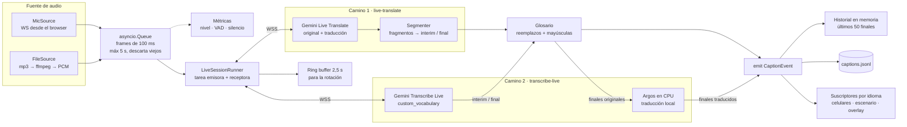

PNG: `docs/diagrams/03-pipeline.png`

---

## 4. Secuencia: ciclo de vida de una charla

Desde que el operador crea la sala hasta que el público ve el resumen al terminar.

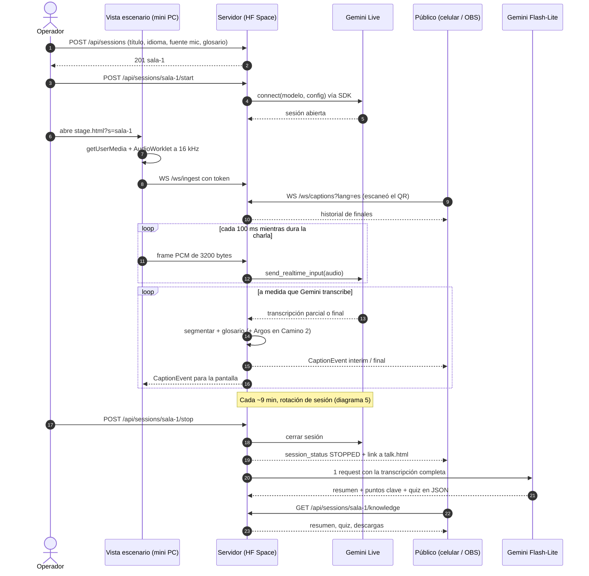

PNG: `docs/diagrams/04-secuencia-charla.png`

---

## 5. Secuencia: rotación de la sesión Live

Cómo se evita el corte de ~10 minutos de la Live API sin perder audio ni duplicar frases. Es la pieza más riesgosa (T2.1).

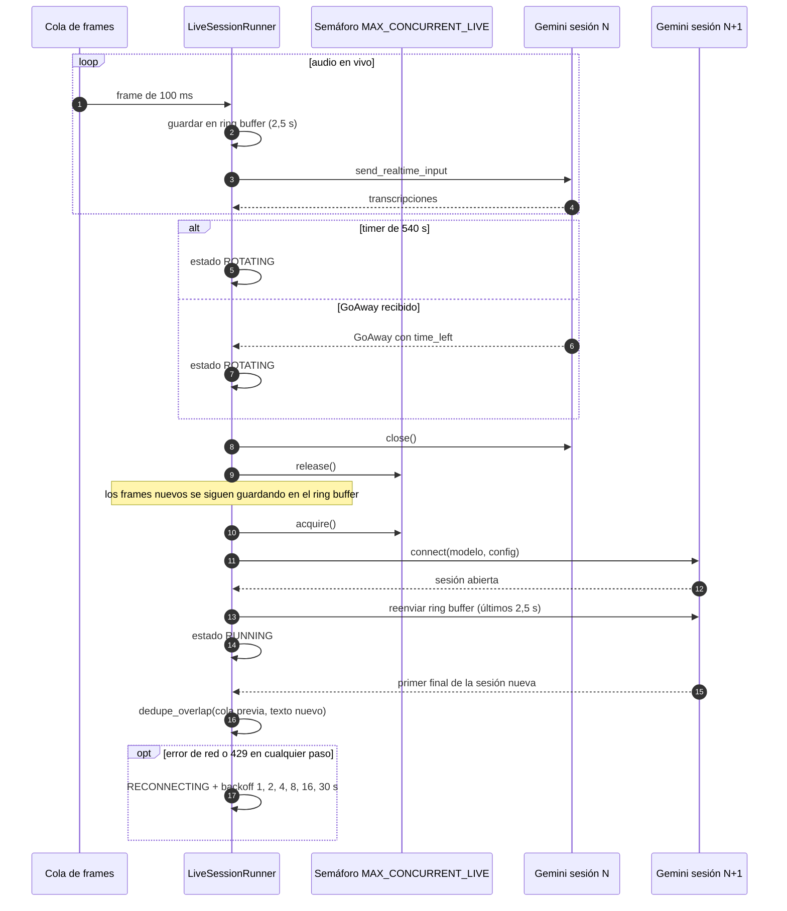

PNG: `docs/diagrams/05-rotacion.png`

---

## 6. Estados de una sala

Estados que muestra el panel de monitoreo y qué los provoca.

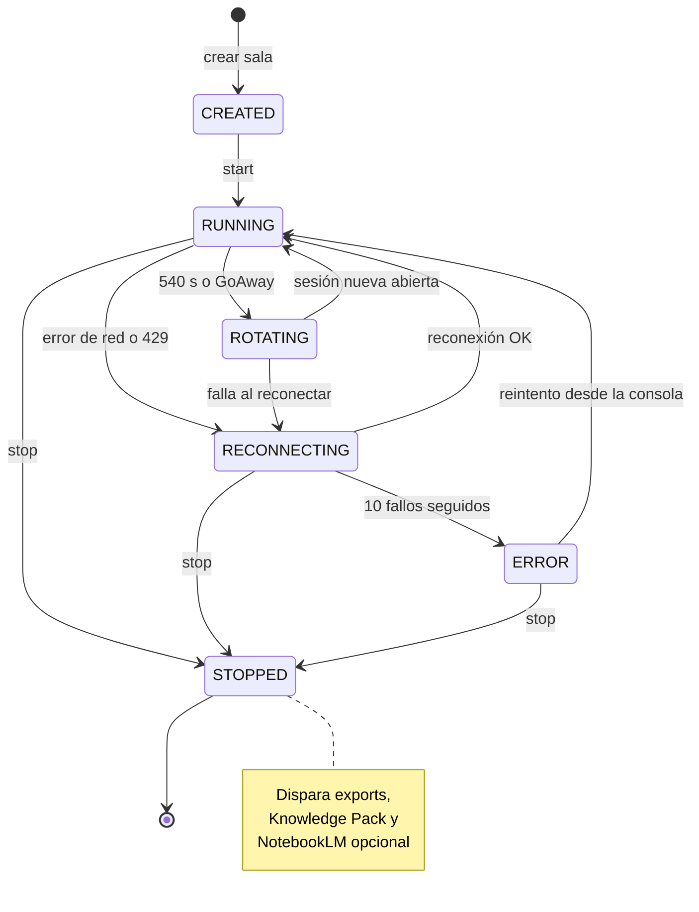

PNG: `docs/diagrams/06-estados.png`

---

## 7. Flujo del público

Qué ve una persona desde que escanea el QR hasta después de la charla. El mismo QR sirve antes, durante y después.

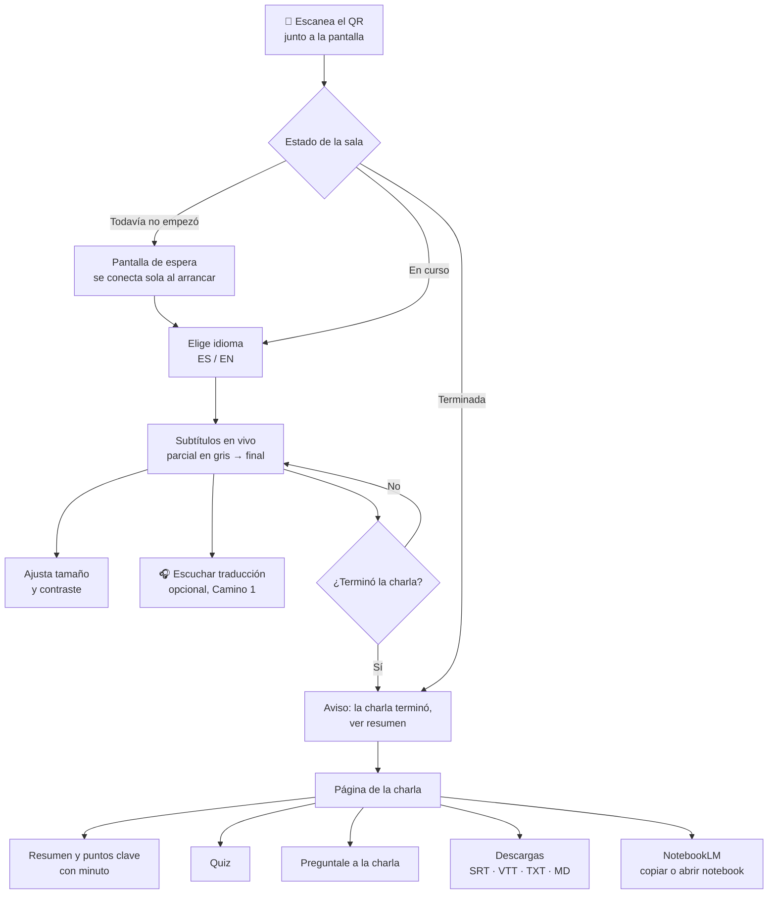

PNG: `docs/diagrams/07-audiencia.png`

---

## 8. Flujo del operador

Preparación única antes del evento y rutina por sala el día del evento.

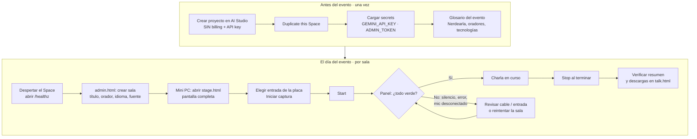

PNG: `docs/diagrams/08-operador.png`

---

## 9. Despliegue

Cómo llega el código al Space y cómo lo replica otra conferencia. Incluye la alternativa sin nube en la mini PC.

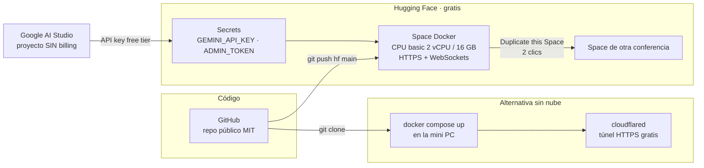

PNG: `docs/diagrams/09-despliegue.png`

---

## 10. Escalado a muchas salas

Se escala duplicando Spaces por grupo de salas, sin estado compartido. El techo real es el cupo de sesiones Live por proyecto de Gemini. Si se usan keys de distintos proyectos, que sean de personas u organizaciones distintas y revisar antes los términos de uso de Google.

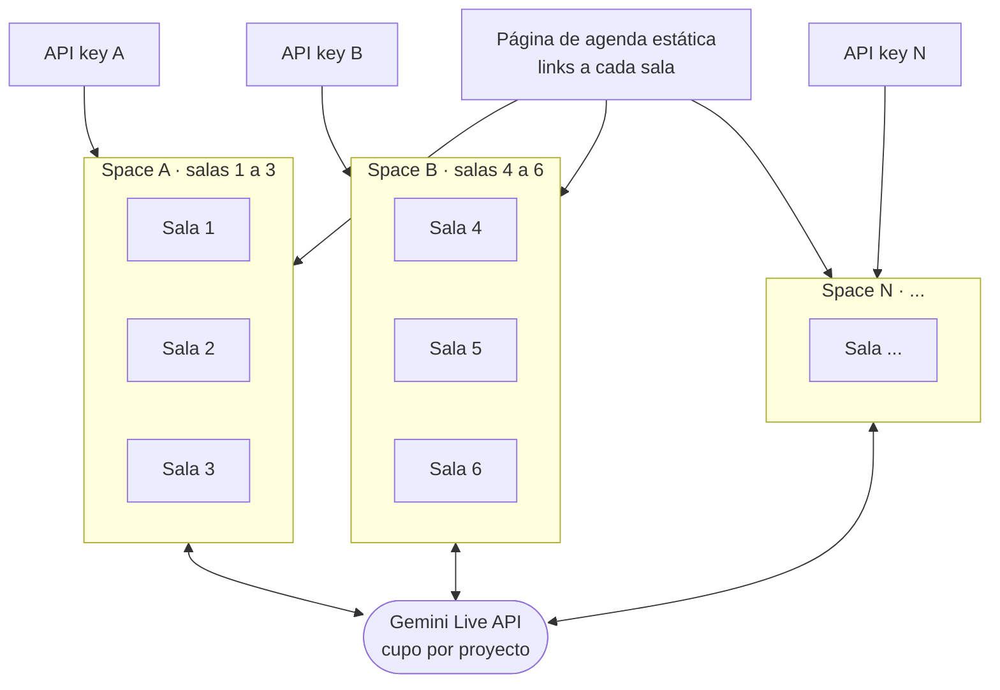

PNG: `docs/diagrams/10-escalado.png`

---

## 11. Decisión de camino en H0

Árbol de decisión a partir de las cuotas que muestre AI Studio (T0.2 y T0.3).

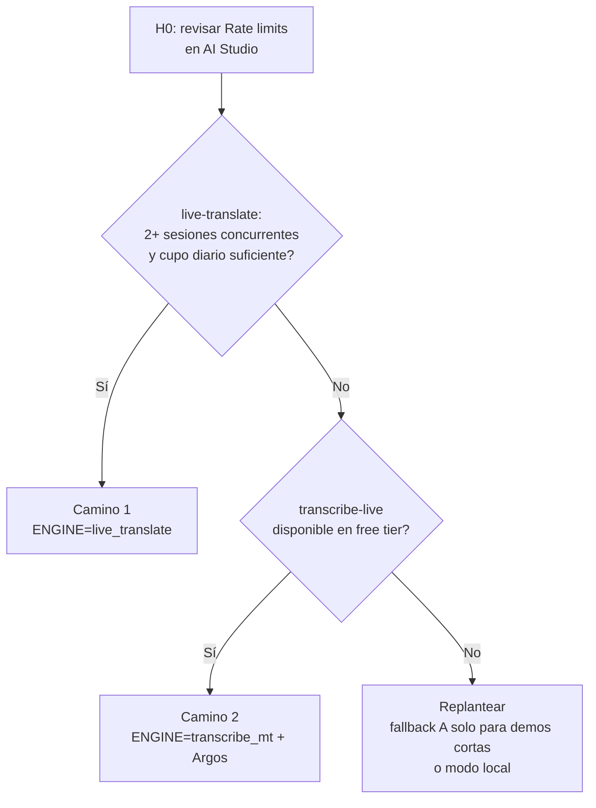

PNG: `docs/diagrams/11-decision-h0.png`

---
