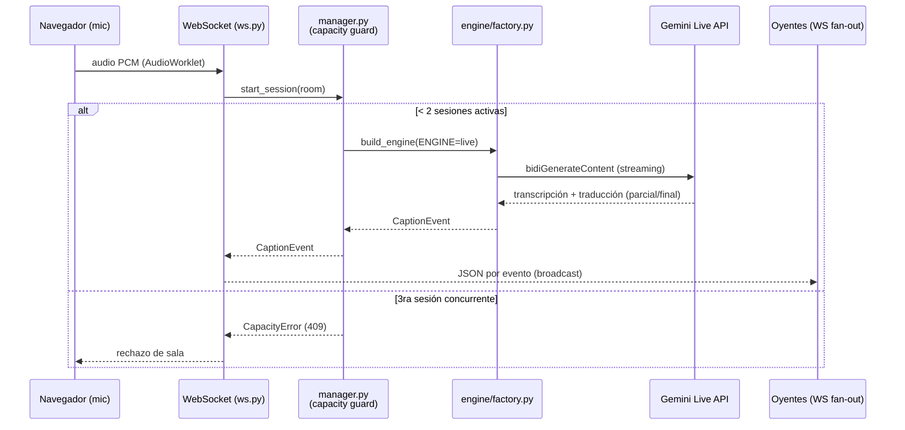
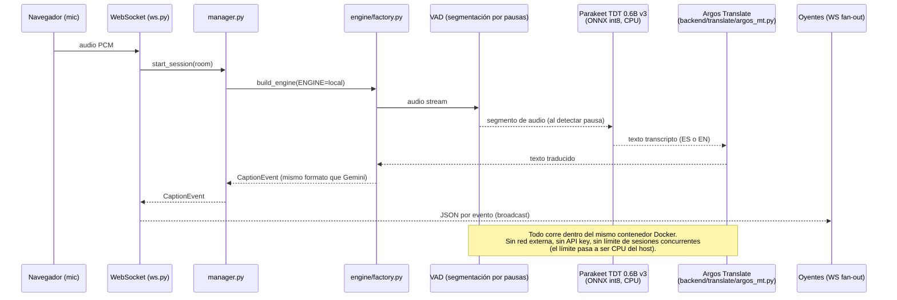
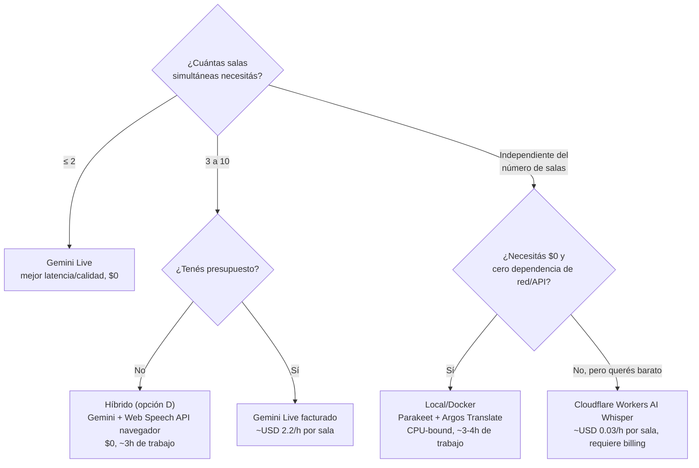

# Resumen de estado + flujos (actual y plan B local)

> Doc de síntesis para alinear rápido con el equipo. El análisis detallado ya existe en
> [`OPCIONES-ESCALADO.md`](./OPCIONES-ESCALADO.md) (hosting/concurrencia) y
> [`OPCIONES-TRANSCRIPCION.md`](./OPCIONES-TRANSCRIPCION.md) (motores locales/open-source).
> Este doc no repite ese contenido: lo resume, lo visualiza con diagramas y da una recomendación clara.

## 1. Estado actual (resumen ejecutivo)

El pipeline hoy es: navegador captura audio → WebSocket → `backend/core/manager.py` (guard de
capacidad) → `backend/engine/factory.py` elige motor → **Gemini Live** (`gemini-3.5-live-translate-preview`)
hace transcripción + traducción EN↔ES en una sola sesión de streaming → eventos de caption →
`backend/api/ws.py` reparte a todos los oyentes de la sala.

**El límite real no es de hosting, es de cupo de Gemini**: el tier gratuito de AI Studio soporta
**2 sesiones Live concurrentes** de forma estable (medido en `scripts/live_probe.py`, T2.10a). Esto ya
está reflejado en código: `MAX_CONCURRENT_LIVE=2` en `backend/config.py`, forzado por
`backend/core/manager.py`, que rechaza una 3ª sala con `CapacityError` (HTTP 409). Ningún cambio de
hosting (Cloudflare, HF, Oracle) aumenta ese cupo — es un límite por proyecto de Google, no de dónde
corre el backend.

Motores existentes hoy (`backend/engine/`), todos detrás de la misma interfaz `Engine` (ABC en
`backend/engine/base.py`) y el mismo evento `CaptionEvent` (`backend/core/events.py`):

| Motor | Archivo | Uso |
|---|---|---|
| Gemini Live (principal) | `live_translate.py` + `live_runner.py` | Streaming real, mejor latencia/calidad |
| Gemini chunked (fallback) | `chunked.py` | Si Live falla, transcribe por chunks |
| Replay (demo sin API) | `replay.py` | Reproduce `samples/replay_demo.jsonl`, sin red |
| Transcribe+MT separado (no wireado) | `transcribe_mt.py` | Camino 2, pendiente |

No hay `docker-compose.yml` en el repo — solo un `Dockerfile` de un único contenedor Python 3.12,
deployado como Hugging Face Space (`make deploy`). Esto ya es "fácil de desplegar tipo Docker"; lo que
falta para operar **sin API de Gemini** es un motor alternativo, no cambiar la infraestructura.

## 2. Recomendación

**Seguir con las tasks actuales (`backend/docs/TASKS.md`) sin parar a rearmar el motor.** El repo ya
tiene el análisis de costo/escalado hecho y la conclusión es consistente: para el hackathon, Gemini
gratis alcanza para demo (2 salas); el modo local es plan B, no bloqueante.

**Criterio de disparo explícito** para migrar (parcial o totalmente) a un motor local:
- Necesitás demostrar **más de 2 salas simultáneas** en vivo durante el evento.
- Se corta o degrada el cupo gratuito de Gemini (rate limit persistente, no solo el guard de 2).
- Deciden que el proyecto tiene que quedar operable post-hackathon sin depender de billing/API key.

Si se dispara alguno de esos casos, el camino más barato en horas es la **opción D** ya documentada en
`OPCIONES-ESCALADO.md`: motor híbrido por sala (Gemini para N salas prioritarias + Web Speech API del
navegador para el resto), estimado en ~3h. El modo 100% local con Docker (sin ningún motor de nube) es
más trabajo (~3-4h adicionales) pero es el que responde a "sin usar la API de Gemini" — ver sección 4.

## 3. Flujo actual (Gemini Live)

Puntos débiles conocidos (ya listados en `OPCIONES-ESCALADO.md` sección 6, independientes de qué motor
se use): `ws.py` serializa el JSON una vez por cada oyente en vez de una vez por evento, no hay throttle
de captions interinas (pueden salir más rápido de lo legible), y arrancar varias salas Live juntas
degrada la latencia si no se escalonan ~20-30s entre sí.

## 4. Flujo alternativo local/Docker (plan B, sin Gemini)

Mismo contrato (`Engine` ABC, `CaptionEvent`, `ws.py`) — el único cambio es qué implementa `Engine.run()`,
seleccionado por la variable de entorno `ENGINE` en `factory.py`. No es una reescritura del backend.

**Trade-off principal:** este camino no es streaming continuo palabra-a-palabra como Gemini Live — es
segmentado por pausas de voz (VAD), así que la latencia percibida depende de la duración de las frases,
no de un delay fijo bajo. Para mantener baja latencia: segmentos cortos (VAD agresivo, ~1-2s de pausa),
Parakeet en int8 (ya recomendado en `OPCIONES-TRANSCRIPCION.md` por ser el mejor CPU-only), y evitar
encolar traducción — Argos es rápido en CPU para frases cortas.

Piezas ya existentes para este camino: `backend/translate/argos_mt.py` (stub), `backend/engine/base.py`
(contrato), `backend/engine/factory.py` (switch por env var). Falta: implementar el `Engine` local
(VAD + Parakeet + Argos), estimado ~3-4h en `OPCIONES-TRANSCRIPCION.md`.

## 5. Cuándo usar cada motor (decisión)

## 6. Próximos pasos accionables

**Ahora (no bloqueante, seguir con tasks):**
- Continuar `backend/docs/TASKS.md` sobre el motor Gemini actual.
- Aplicar los 4 fixes de backend recomendados igual en `OPCIONES-ESCALADO.md` sección 6 (útiles pase lo
  que pase con el motor): serializar JSON una vez por evento en `ws.py`, throttle de captions interinas
  a ≤4/s, escalonar arranque de sesiones Live nuevas (~20-30s), y hacer el motor seleccionable por sala
  (no solo global) en `factory.py`.

**Si se dispara el criterio de migración (sección 2):**
1. Implementar `Engine` local (VAD + Parakeet + Argos) siguiendo el contrato de `base.py` — ~3-4h.
2. Registrar el nuevo motor en `factory.py` bajo `ENGINE=local`, probar en el mismo `Dockerfile` (sin
   cambios de infraestructura, ya corre en un solo contenedor).
3. Si además hace falta más audiencia (no solo motor), evaluar la opción B2 de
   `OPCIONES-ESCALADO.md` (Cloudflare Durable Objects para fan-out) — no toca el motor, es aparte.
