# Arquitectura — Nerdearla Live Captions

> **Qué es este documento:** la única fuente sobre arquitectura. Cubre lo que está implementado, el diseño objetivo, el comportamiento medido de Gemini Live, el despliegue, la escalabilidad y las decisiones. Qué se hace y en qué orden está en [`ROADMAP.md`](ROADMAP.md). Cuántas salas soportamos está en [`CONCURRENCY-REPORT.md`](CONCURRENCY-REPORT.md), la fuente de verdad sobre capacidad. Las alternativas no implementadas están en [`alternatives/`](alternatives/).
>
> Estados (`DOCUMENTED`, `OBSERVED`, `HYPOTHESIS`, `EXPERIMENT`, `RESULT`, `DECISION`) según la [convención del reporte](CONCURRENCY-REPORT.md#convención-de-estados). Diagramas en Mermaid: GitHub los renderiza directo en este archivo.
>
> Última revisión: 2026-09-25.

## Índice

1. [Propósito y restricciones](#1-propósito-y-restricciones)
2. [Arquitectura actual (implementado)](#2-arquitectura-actual-implementado)
3. [Comportamiento medido de Gemini Live](#3-comportamiento-medido-de-gemini-live)
4. [Diseño objetivo](#4-diseño-objetivo)
5. [Despliegue y hosting](#5-despliegue-y-hosting)
6. [Escalabilidad](#6-escalabilidad)
7. [Decisiones](#7-decisiones)
8. [Referencias](#8-referencias)

---

## 1. Propósito y restricciones

**Problema:** las conferencias open source no pueden ofrecer subtítulos y traducción en vivo a escala, porque las soluciones actuales son comerciales, caras, manuales y no replicables. Nerdearla lo siente este año con 30+ charlas en inglés, muchas en simultáneo.

**Diferenciador:** el motor de transcripción ya es commodity (Google publicó ejemplos oficiales de traducción en vivo para eventos). Lo que nos diferencia es:

- **Capa de operación de evento:** subtítulos en ~1–2 s con glosario por charla, en tres superficies (pantalla del escenario, celular vía QR, overlay para OBS/vMix) y un panel de monitoreo.
- **Costo cero operativo:** la única dependencia en la nube que corre segundo a segundo es **una sesión de audio Live por sala**. Todo lo demás corre gratis en el mismo container; las llamadas a modelos de texto se reducen a 1–2 por charla.
- **Después de la charla:** al hacer *stop*, la charla se convierte sola en un **Knowledge Pack** (resumen, puntos clave, quiz, "Preguntale a la charla") y opcionalmente en un notebook de NotebookLM con podcast.

**Pitch:** *"Duplicás el Space, pegás una API key gratis, y tenés N escenarios subtitulados en dos idiomas."* (Cuántos son N: ver §6; no está garantizado por el free tier).

### Restricciones de producto y técnicas

Las de equipo, tiempo y deadline están en [`ROADMAP.md`](ROADMAP.md#restricciones-de-equipo-y-tiempo).

| Tema | Decisión |
|---|---|
| Costo | **Cero, 100%.** Solo free tier de Gemini, sin créditos |
| Duración de charlas | ~40 minutos |
| Idiomas | EN → ES y ES → EN (los dos) |
| Español de salida | Neutro (`es`, default de los modelos) |
| Despliegue | Hosteado, gratis, sencillo de replicar en cualquier conferencia, idealmente escalable |
| Frontend | HTML + JS vanilla, sin build |
| NotebookLM | Sencillo e idealmente automatizado |

### Contexto del sistema

Quién usa el sistema y con qué servicios externos habla. Muestra las tres conexiones WebSocket: **#1** audio del escenario al servidor, **#2** servidor ↔ Gemini Live (la maneja el SDK) y **#3** subtítulos hacia el público. Es el diseño objetivo: hoy la fuente es solo `file` (ver §2).

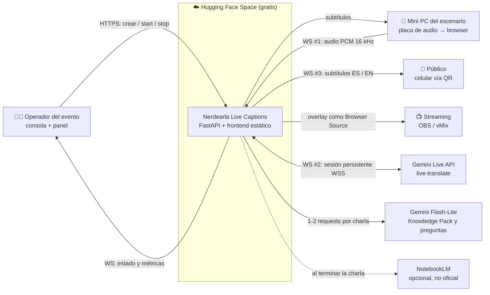

---

## 2. Arquitectura actual (implementado)

Lo que está **implementado hoy** en la rama `status` (base `fad0aee` + `CapacityGuard`, `LoopLagMonitor` y los probes). No incluye propuestas.

Un solo proceso Python (FastAPI + uvicorn, un event loop) corre todas las salas. Cada sala con motor Live mantiene una sesión Gemini Live (WebSocket `bidiGenerateContent`) que devuelve el original y la traducción.

Se separan dos planos:

| Plano | Responsabilidad | Componentes |
|---|---|---|
| **Control** | Salas, ciclo de vida, capacidad, configuración, estado | `SessionManager`, `CapacityGuard`, `Settings`, `Session` (estado y transiciones), `/healthz`, `/api/public/sessions` |
| **Datos** | Audio → Live → segmentación → `CaptionEvent` → fan-out | `FileSource` → `FrameQueue` → `LiveTranslateEngine` (`LiveSessionRunner` + 2 `Segmenter` + glosario) → `Session.emit` → colas por cliente → `WS /ws/captions/{id}`; en paralelo, `CaptionWriter` |

En esta fase, `SessionManager` cumple los dos papeles de coordinación: registro y ciclo de vida de salas (control) y punto de entrada del pub/sub hacia los clientes (fan-out). Es suficiente para un proceso (decisión [D6](#decisiones-vigentes)).

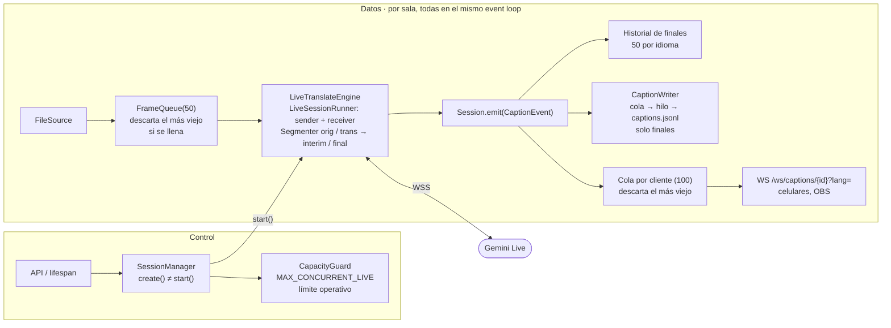

### Componentes

| Componente | Archivo | Qué hace hoy |
|---|---|---|
| `Settings` | `backend/config.py` | Variables de entorno (`ENGINE`, `MAX_CONCURRENT_LIVE`, `DEMO_ROOMS`…) |
| `SessionManager` | `backend/core/manager.py` | Registro de salas. `create()` solo registra; `start()` construye el motor, reserva cupo Live si corresponde y arranca. `stop()`, `delete()`, `subscribe()` |
| `CapacityGuard` | `backend/core/capacity.py` | Cupos Live por sala. `reserve()` antes de arrancar, **nunca espera**: si está lleno lanza `CapacityError`. Se libera si el arranque falla y cuando la corrida termina (fin, error o stop). Una sala que ya tiene cupo lo conserva (rotación o reconexión) |
| `Session` | `backend/core/session.py` | Una sala: estado (`CREATED/RUNNING/…/ERROR/STOPPED`), tarea `_run`, pub/sub por idioma, historial para quien entra tarde, métricas (`events`, `dropped_frames`, `captions_written`, `write_errors`, `append_ms_max`) |
| `CaptionWriter` | `backend/core/persistence.py` | Cola + tarea propia; el append a disco corre en `asyncio.to_thread`. `put()` no espera nunca; `close()` drena la cola. Un `OSError` se cuenta y se loguea, y la sala sigue |
| `Engine` | `backend/engine/base.py` | Contrato: `run(frames, emit, ctx)`; `needs_audio`, `uses_live` |
| `LiveTranslateEngine` | `backend/engine/live_translate.py` | Camino 1: dos segmentadores (original y traducción) + glosario; cuenta `callback_errors` |
| `LiveSessionRunner` | `backend/engine/live_runner.py` | Una conexión Live: envía frames y despacha mensajes. `stats`: `connect_ms`, `first_text_s`, `msgs`, `text_times`, `first_error_s`, `dispatch_ms_max`, handle de reanudación… **Sin rotación ni reconexión** (T2.1) |
| `ChunkedEngine` | `backend/engine/chunked.py` | Fallback A: chunks REST de 5 s, prompt EN↔ES en español neutro, sin thinking |
| `ReplayEngine` | `backend/engine/replay.py` | Re-emite un jsonl a su ritmo original, sin API (demo y prueba de audiencia) |
| `Segmenter` | `backend/core/segmenter.py` | Fragmentos delta → interim / final (puntuación, largo o `SEGMENT_IDLE_S` sin fragmentos) |
| Glosario | `backend/core/glossary.py` | Reemplazos + normalización de mayúsculas; merge default + sala |
| `LoopLagMonitor` | `backend/core/loop_monitor.py` | Tick cada 100 ms; mide cuánto se atrasa el event loop. Expuesto en `/healthz` (`loop_lag_ms`, últimos 10 s) |
| WS de captions | `backend/api/ws.py` | Al conectar: estado + historial; después, eventos en vivo. Una tarea lectora y una escritora por cliente |
| Errores HTTP | `backend/api/errors.py` | `CapacityError` → **409** (queda activo cuando exista `POST /api/sessions/{id}/start`, T2.5) |
| Página de audiencia | `frontend/index.html`, `js/captions.js` | Lista de salas, interim → final, cambio de idioma, A−/A+, alto contraste, reconexión con backoff |

### Qué **no** está implementado (a la fecha)

| Pieza | Tarea | Consecuencia |
|---|---|---|
| Rotación + reanudación + reconexión | T2.1 | Una conexión Live dura ~10 min (`GoAway` a los 9:00, corte a los 9:50). Una sala no pasa de ~10 min |
| API de administración (crear/arrancar/parar) | T2.5 | Las salas se crean al arrancar (`seed_demo`) o desde los scripts. El 409 todavía no se ve por HTTP |
| Ingesta de mic por WS | T2.6 / T2.7 | Solo fuente `file` |
| Métricas completas (nivel, latencias, cuota) | T2.4 | Hay `runner.stats`, métricas de sala y lag del loop |
| Vista de escenario, consola, página de la charla | T2.8 / T2.9 / T3.5 | `stage.html`, `admin.html`, `talk.html` son esqueletos |
| Post-charla (exports, Knowledge Pack, NotebookLM) | T3.3 / T3.4 / T3.9 | `post/` son esqueletos |
| Motor por sala | T2.14 | `ENGINE` es global: todas las salas usan el mismo motor |

### Herramientas de medición

| Script | Capa | Uso |
|---|---|---|
| `scripts/spike_live.py` | SDK crudo | Mediciones de T1.4 (§3) |
| `scripts/live_probe.py` | SDK crudo | N sesiones Live sin código nuestro |
| `scripts/runner_probe.py --layer engine` | Engine | N `LiveTranslateEngine` en un proceso |
| `scripts/runner_probe.py --layer session` | Runner completo | Lo mismo vía `SessionManager` (`Session` + `CaptionWriter` + fan-out), sin HTTP |
| `scripts/audience_load.py` | Fan-out | K clientes WS contra salas replay: sin Gemini |
| `scripts/probe_metrics.py` | — | Clasificación objetiva y tablas a partir de los reportes |

Todos los reportes llevan branch + commit + fecha + versión del SDK (`scripts/report_meta.py`). La medición de `runner_probe` tiene defectos conocidos: ver [reporte §6](CONCURRENCY-REPORT.md#validez-de-la-medición) y T2.12 en el roadmap.

---

## 3. Comportamiento medido de Gemini Live

### Modelos Live de Google para este caso

- **`gemini-3.5-live-translate-preview`** (el que usamos, Camino 1): traducción speech-to-speech en tiempo real, 70+ idiomas, stream continuo. Devuelve transcripción del original **y** de la traducción en la misma sesión. No acepta instrucciones → sin glosario en el prompt.
- **`gemini-3.5-transcribe-live`** (Camino 2, no implementado): STT en streaming con transcripciones *interim* y *finales*. Acepta `custom_vocabulary` de hasta 1.000 términos (rinde mejor con ~100) y modo `SMART`.

### Mediciones (T1.4)

Medido el 24/9/2026 con `gemini-3.5-live-translate-preview`: `samples/en_talk_3min.mp3` (EN → ES, 3 min y 10 min en loop) y `samples/es_talk_2min.mp3` (ES → EN). Herramienta: `scripts/spike_live.py` (log crudo en `data/spike/`, no se commitea). Las latencias usan un VAD por energía (−45 dBFS), así que son aproximadas.

| # | Pregunta | Resultado |
|---|---|---|
| 1 | Semántica de los fragmentos | **Delta**: cada mensaje trae solo el texto nuevo, con espacio inicial, y hay que concatenarlo (el segmentador ya lo hace). No llega `interim_input_transcription` y `finished` nunca vale `True`: los finales los arma el segmentador. |
| 2 | Cadencia y largo | ~1 mensaje/s por track (p50 1,0 s), ~13 caracteres (máx. 35). Además llegan audio traducido continuo (4 chunks/s, a tiempo real), `usage_metadata` y `session_resumption_update` (~1/s). |
| 3 | Latencia | Voz → primer fragmento del original: p50 0,5–0,6 s. Fin de voz → siguiente fragmento: p50 0,45–0,55 s. Traducción ES → EN: p50 0,6 s, sin huecos de más de 2 s. **Traducción EN → ES: arranca 0,2–0,5 s detrás del original, pero en la corrida de 10 min (casi siempre con otra sesión en paralelo, ver [reporte de concurrencia](CONCURRENCY-REPORT.md)) tuvo frenazos de 12 a 55 s seguidos de ráfagas y a los 10 min cubría el 84 % del texto. Sola, la corrida de 3 min terminó de traducir ~20 s después del final del audio.** Al final de cada segmento se suma el segmentador (puntuación o `SEGMENT_IDLE_S` sin fragmentos). |
| 4 | Glosario | Bien escritos: Unix, Windows, Emacs, Wayland, Go, Bell Labs, MIPS, Pentium, Greenfield. Mal: "UTF-8" → "UTF", "TCP/IP" → "TCP IP", "Brownfield" → "groundfield" (y una vez "Greenfield"). El Camino 1 no acepta vocabulario: el post-proceso corrige errores consistentes (`groundfield => Brownfield`, `TCP IP => TCP/IP`), pero no palabras que el modelo omite ni confusiones con otro término válido. |
| 5 | `SMART` vs `VERBATIM` | N/A (solo Camino 2) |
| 6 | Límite de sesión | La **conexión** dura ~10 min: `GoAway` a los **540,6 s (9:00)** con `time_left=50s`; si el cliente no cierra, el servidor corta a los **590,7 s** con `ConnectionClosedError 1008 (policy violation)`. La **sesión** solo de audio dura 15 min sin compresión (docs), y se puede **reanudar** en otra conexión con el handle de `session_resumption_update` (llegan ~1/s con `resumable: true`, válidos 2 h). Probado: reconexión con el handle en 1,3 s y el texto sigue sin repetir. La rotación de T2.1 se basa en eso. |

Otros datos:

- Al terminar el audio, el modelo sigue mandando audio traducido ~15 s más; por eso el runner espera hasta 30 s antes de cerrar (`drain_max_s`).
- **Segmentador:** el corte por silencio pasó de 1,2 s a **2,0 s** (`SEGMENT_IDLE_S`, provisorio). Reproduciendo sin red los fragmentos reales del spike EN (cadencia normal), los cortes por silencio bajan de 4 a 1 en el original y de 10 a 8 en la traducción, con la misma cantidad de finales (34 y ~25). Los finales cortos que quedan en la traducción ("Este," o "para") vienen de sus frenazos de más de 2 s: ningún corte fijo los evita.
- **Concurrencia:** ver [`CONCURRENCY-REPORT.md`](CONCURRENCY-REPORT.md). En corto: *2 sesiones concurrentes son una capacidad operativa observada, todavía no garantizada*.

---

## 4. Diseño objetivo

Hacia dónde va la arquitectura. Cada pieza lleva su tarea en [`ROADMAP.md`](ROADMAP.md); lo que ya existe está en §2.

### 4.1 Componentes

Módulos del repo y cómo se relacionan. El frontend es estático y lo sirve el mismo FastAPI; cada sala corre su propio pipeline dentro de una `asyncio.Task`.

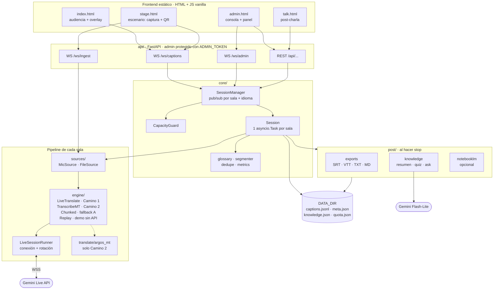

### 4.2 Estructura del repo

✅ implementado · 🟡 parcial · ⬜ esqueleto (archivo vacío creado en T0.4).

```
backend/
  app.py                 ✅ FastAPI: rutas, static, lifespan
  config.py              ✅ Settings (pydantic-settings)
  main_cli.py            ✅ CLI
  api/
    sessions.py          🟡 /healthz y /api/public/sessions; falta el REST admin (T2.5)
    ws.py                🟡 WS de captions; faltan ingest / admin / audio
    errors.py            ✅ CapacityError → 409
    auth.py              ⬜ dependencia ADMIN_TOKEN (T2.5)
  core/
    events.py            ✅ CaptionEvent
    session.py           ✅ Session (stage worker)
    manager.py           ✅ SessionManager
    capacity.py          ✅ CapacityGuard
    loop_monitor.py      ✅ LoopLagMonitor
    persistence.py       ✅ CaptionWriter
    glossary.py          ✅ carga y aplicación del glosario
    segmenter.py         ✅ fragmentos -> interim/final (Camino 1)
    metrics.py           🟡 nivel, VAD local, latencias, cuota (T2.4)
    dedupe.py            ⬜ dedupe_overlap() (T2.1)
  sources/
    base.py              ✅ FrameQueue + pump
    file_source.py       ✅
    mic_source.py        ⬜ alimentado por WS (T2.6)
  pipeline/
    normalize.py         ✅
    chunker.py           ✅ (fallback A)
  engine/
    base.py              ✅ Engine ABC
    factory.py           ✅
    live_runner.py       🟡 LiveSessionRunner (falta rotación, T2.1)
    live_translate.py    ✅ Camino 1
    chunked.py           ✅ fallback A
    replay.py            ✅ ReplayEngine
    transcribe_mt.py     ⬜ Camino 2 (no se hace)
  translate/
    argos_mt.py          ⬜ Camino 2 (no se hace)
  post/
    exports.py           ⬜ SRT/VTT/TXT/MD (T3.3)
    knowledge.py         ⬜ Knowledge Pack + ask (T3.4, T3.6)
    notebooklm.py        ⬜ opcional (T3.9)
frontend/
  index.html             ✅ audiencia (lista + subtítulos; overlay en T3.1)
  stage.html             ⬜ vista de escenario (T2.8)
  admin.html             ⬜ consola de operador + panel (T2.9, T3.2)
  talk.html              ⬜ página post-charla (T3.5)
  js/ common.js ✅ captions.js ✅ mic.js ⬜ pcm-worklet.js ⬜ admin.js ⬜ talk.js ⬜
  css/ style.css         ✅
config/glossary.default.json
samples/                 # mp3 recortados + replay_demo.jsonl
scripts/                 # probes y mediciones (§2)
tests/                   # pytest
docs/                    # esta documentación
Dockerfile  Makefile  README.md  LICENSE
```

### 4.3 Pipeline de datos de una sala

Camino que recorre el audio hasta convertirse en subtítulos, con las dos variantes del motor. Solo uno de los dos caminos está activo según `ENGINE` (hoy, Camino 1).

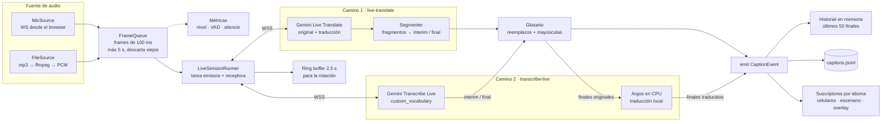

Cada sala corre su tubería completa, aislada: si una falla, no afecta al resto. Todas comparten el event loop, así que nada en el camino Gemini → segmentador → broadcast puede bloquear: la escritura de `captions.jsonl` va por una cola y un hilo (`core/persistence.py`). Cada cliente de audiencia tiene una cola acotada: si un celular es lento, se descartan mensajes viejos en vez de frenar la sala.

### 4.4 Contratos

Congelados en T0.5.

**Evento de caption** (`backend/core/events.py`; todo pasa por este JSON):

```python
class CaptionEvent(BaseModel):
    type: Literal["caption"] = "caption"
    session_id: str
    lang: Literal["en", "es"]
    kind: Literal["orig", "trans"]
    seg: int                 # id de segmento por (session, lang); interim y final comparten seg
    final: bool
    text: str
    t0: float                # segundos desde el start de la sesión
    t1: float
    lat_ms: int | None = None
```

**Engine** (`backend/engine/base.py`):

```python
class Engine(ABC):
    @abstractmethod
    async def run(self, frames: AsyncIterator[AudioFrame],
                  emit: Callable[[CaptionEvent], Awaitable[None]],
                  ctx: "SessionContext") -> None: ...
```

`SessionContext` expone `session_id`, `source_lang`, `target_lang`, `glossary`, `metrics`.

**Endpoints** (✅ implementado · ⬜ pendiente):

| Método | Ruta | Auth | Uso | Estado |
|---|---|---|---|---|
| `GET` | `/healthz` | — | Healthcheck + `loop_lag_ms` | ✅ |
| `GET` | `/api/public/sessions` | — | Lista pública: id, título, orador, idiomas, estado | ✅ |
| `POST` | `/api/sessions` | admin | Crear sala | ⬜ T2.5 |
| `POST` | `/api/sessions/{id}/start` | admin | Arrancar (409 sin cupo) | ⬜ T2.5 |
| `POST` | `/api/sessions/{id}/stop` | admin | Parar | ⬜ T2.5 |
| `DELETE` | `/api/sessions/{id}` | admin | Borrar | ⬜ T2.5 |
| `GET` | `/api/sessions` | admin | Estado completo + métricas | ⬜ T2.5 |
| `POST` | `/api/uploads` | admin | Subir mp3 | ⬜ T2.5 |
| `GET` | `/api/sessions/{id}/export.{srt,vtt,txt,md}?lang=` | — | Exports | ⬜ T3.3 |
| `GET` | `/api/sessions/{id}/knowledge` | — | Knowledge Pack | ⬜ T3.4 |
| `POST` | `/api/sessions/{id}/ask` | — (rate limit) | Preguntale a la charla | ⬜ T3.6 |
| `WS` | `/ws/ingest/{id}?token=` | admin | Audio del mic (PCM16 16 kHz, frames de 100 ms) | ⬜ T2.6 |
| `WS` | `/ws/captions/{id}?lang=` | — | Subtítulos (historial + vivo; 4404/4400) | ✅ |
| `WS` | `/ws/admin?token=` | admin | Snapshot de estado cada 1 s | ⬜ T3.2 |

### 4.5 Ciclo de vida de una charla

Desde que el operador crea la sala hasta que el público ve el resumen al terminar.

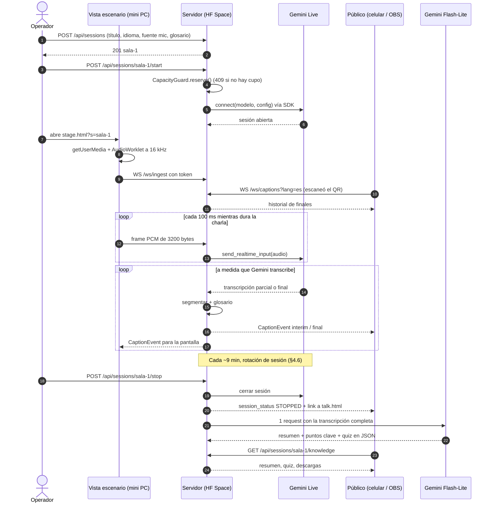

### 4.6 Rotación de la sesión Live (pieza más riesgosa, T2.1)

Hay que distinguir dos límites (docs de *session management* + medición de T1.4):

- **Conexión (WebSocket): ~10 min.** Medido: `GoAway` a los 9:00 con `time_left=50s`; si el cliente no cierra, corte a los 9:50 con `1008`.
- **Sesión solo de audio: 15 min sin compresión**, extensible con `context_window_compression` (ventana deslizante). Para charlas de 40 min hay que activarla (verificar que live-translate la acepte).

Cómo se rota:

- **Reanudar, no empezar de cero:** pedir `session_resumption` y guardar el último handle de `session_resumption_update` (válido 2 h). Ante `GoAway` o a los ~9 min (`ROTATE_AFTER_S`), reconectar pasando ese handle: el modelo conserva el contexto. Además evita abrir sesiones nuevas, que es lo que se vio degradar el servicio (reporte §5).
- **Audio durante la reconexión:** se acumula en un buffer y se manda apenas conecta; `last_consumed_client_message_index` dice qué audio ya consumió el servidor, para reenviar solo el resto (sin duplicar texto). Solo viene con `SessionResumptionConfig(transparent=True)`: sin eso llegó vacío en el probe.
- **Fallback si la reanudación falla:** sesión nueva + ring buffer de ~2,5 s + dedupe del primer final (`dedupe_overlap`).
- Siempre **secuencial** (cerrar → reconectar): nunca dos conexiones de la misma sala a la vez. La sala conserva su cupo de `CapacityGuard` durante la rotación.
- Backoff exponencial con jitter ante errores o 429 (1, 2, 4, 8, 16, máx. 30 s), sin tumbar la sala.

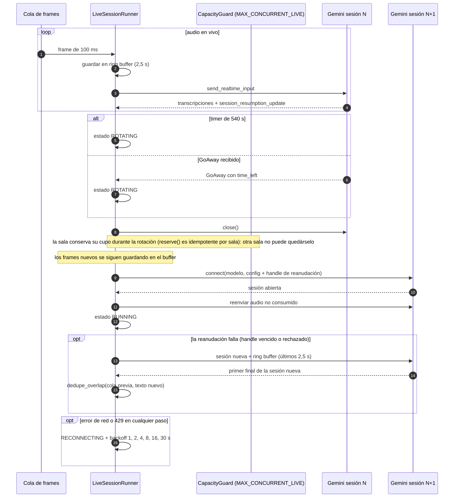

### 4.7 Estados de una sala

Estados que muestra el panel de monitoreo y qué los provoca.

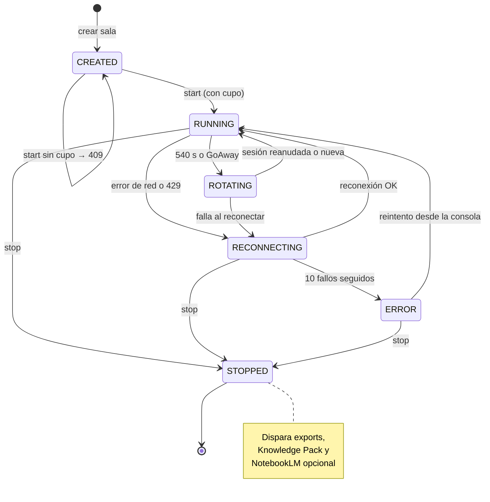

### 4.8 Flujo del público

Qué ve una persona desde que escanea el QR hasta después de la charla. El mismo QR sirve antes, durante y después.

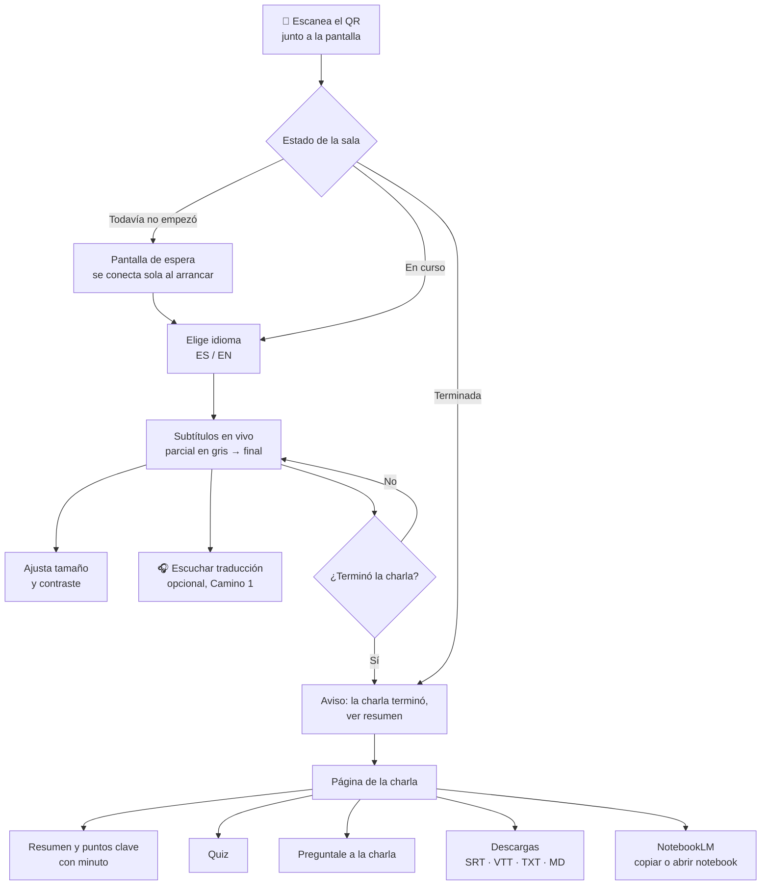

### 4.9 Flujo del operador

Preparación única antes del evento y rutina por sala el día del evento.

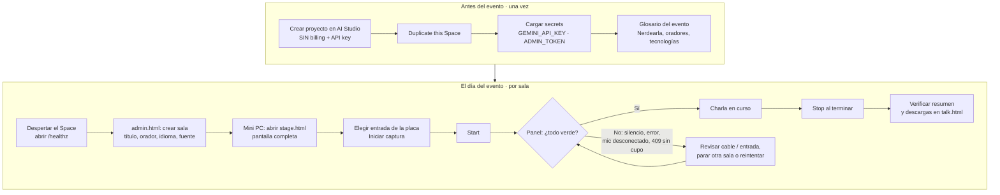

### 4.10 Stack

- **Frontend / UX:**
  - HTML + JS vanilla sin build step, servido por FastAPI.
  - Captura con AudioWorklet → PCM16 16 kHz en frames de 100 ms.
  - `getUserMedia` con `echoCancellation`, `noiseSuppression` y `autoGainControl` en `false` (la señal viene de una consola; esos filtros la degradan).
  - `qrcode.js` por CDN.
  - Overlay = misma página con `?overlay=1` (fondo transparente o chroma, 2 líneas, fuente grande).
  - Vista de escenario = captura + subtítulos + QR en el mismo browser, igual que operan hoy.
- **Backend:** Python 3.12, FastAPI + uvicorn, asyncio, `google-genai==2.25.0`, ffmpeg, pydantic-settings.
- **Almacenamiento:** sin base de datos. `data/sessions/<id>/{meta.json, glossary.json, captions.jsonl}`. Estado vivo en memoria del `SessionManager`.
- **IA (todo free tier):**
  - `gemini-3.5-live-translate-preview` (Camino 1).
  - `gemini-3.1-flash-lite` para la pasada final y el Knowledge Pack (1–2 llamadas por charla).

### 4.11 Después de la charla: Knowledge Pack y NotebookLM

Al hacer *stop*, una sola pasada con Flash-Lite y el glosario completo pule la transcripción y la traducción finales, que alimentan los exports y el Knowledge Pack. NotebookLM, sencillo y automatizado, en 3 capas:

| Capa | Qué hace | Tipo | Esfuerzo |
|---|---|---|---|
| **1. Knowledge Pack en la app** | Al hacer stop, 1–2 llamadas a Flash-Lite generan resumen, puntos clave y quiz. Se ven en la página de la charla (mismo QR) junto con "Preguntale a la charla" (transcripción entera en contexto; límite de preguntas por persona para cuidar la cuota) | Default, automático, oficial | ~2 h |
| **2. Exporter a NotebookLM** | Con `notebooklm-py` (librería no oficial): notebook por charla, transcripción como fuente, podcast (Audio Overview) generado, link en la página de la charla | Opcional, automático, **no oficial** | ~1–1,5 h (stretch) |
| **3. Botón "Copiar para NotebookLM"** | Descarga un `.md` con transcripción + resumen y abre notebooklm.google.com | Siempre disponible | ~15 min |

**Advertencias de la capa 2:** no es oficial, depende de la sesión de navegador de una cuenta Google (guardada como secret) y puede romperse. Va **apagada por defecto** y nunca en el camino crítico. Si falla, las capas 1 y 3 siguen funcionando.

**Por qué no la API oficial:** NotebookLM (renombrado Gemini Notebook en julio 2026) no tiene API pública para cuentas personales; la API oficial es de NotebookLM Enterprise y requiere Google Cloud con licencia paga.

---

## 5. Despliegue y hosting

| Opción | Costo | A favor | En contra | Veredicto |
|---|---|---|---|---|
| **Hugging Face Spaces** (Docker, CPU basic) | Gratis, sin tarjeta | 2 vCPU / 16 GB, HTTPS (el mic funciona), WebSockets, secrets, "Duplicate this Space" = deploy en 2 clics | Disco efímero, se duerme sin tráfico, sin autoscaling | **Elegida** |
| Oracle Cloud Always Free | Gratis (pide tarjeta para verificar) | VM ARM generosa, regiones en Sudamérica | TLS, firewall y servicio a mano | Alternativa "producción" |
| Cloud Run | Free tier, pero exige billing | Autoscaling | Riesgo de cobro; si comparte proyecto con la key, Gemini pasa a pago | Descartada |
| Render free | Gratis | Simple | Se duerme rápido, CPU mínima | Descartada |

Más hostings (Cloudflare, Fly.io) en [`alternatives/CLOUD-EDGE.md`](alternatives/CLOUD-EDGE.md).

- **Latencia:** el salto al servidor suma décimas de segundo; domina el modelo.
- **Requisitos de HF Spaces:** Dockerfile en la raíz, usuario no-root UID 1000, puerto 7860, frontmatter YAML en el README (`sdk: docker`, `app_port: 7860`).
- **Deploy:** `make deploy HF_SPACE=<usuario>/<space>` sube el árbol de trabajo con `hf upload` (ver README).
- **Para cualquier conferencia:** "Duplicate this Space" → pegar `GEMINI_API_KEY` como secret → listo.
- **Sin nube:** `docker compose up` en la mini PC + Cloudflare Tunnel gratis (T3.10).

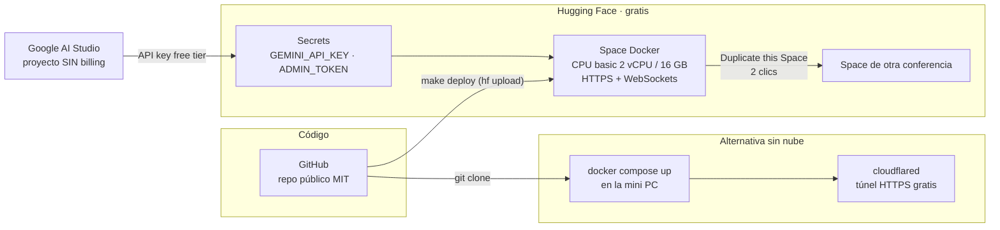

---

## 6. Escalabilidad

Los objetivos y el orden de trabajo están en [`ROADMAP.md`](ROADMAP.md#4-roadmap-de-escalabilidad). Acá, el modelo.

### 6.1 "Escalar" son dos problemas distintos

| Dimensión | Qué la limita | Cómo se mide | Estado hoy |
|---|---|---|---|
| **Salas Live simultáneas** | Principalmente **Gemini**: cupo por proyecto, no publicado para este modelo | `live_probe` / `runner_probe` (bloques A, B, D del barrido) | Ver [reporte §8](CONCURRENCY-REPORT.md#8-veredicto) |
| **Clientes de audiencia** (celulares, OBS) | Principalmente **nuestro backend**: fan-out, WebSockets, CPU del Space | `audience_load` con salas replay, **sin gastar cupo de Gemini** | Ver [reporte §7](CONCURRENCY-REPORT.md#7-prueba-de-audiencia-sin-gemini) |

Mezclarlas lleva a conclusiones falsas. Durable Objects ayuda con la segunda y no con la primera. Activar billing ayuda con la primera y no con la segunda.

### 6.2 Capacidad técnica ≠ operativa ≠ económica

| Nivel | Pregunta | Dónde se responde |
|---|---|---|
| Documentada | ¿Qué publica Google? | Reporte §2 |
| Observada | ¿Qué reproducimos, bajo qué condiciones? | Reporte §5–§7 |
| Operativa | ¿Qué permite el backend? (`MAX_CONCURRENT_LIVE`) | Reporte §2, decisiones D1–D2 |
| Económica | ¿Qué es viable para el producto? | Pendiente de modelar |

### 6.3 Cómo escala hoy

- **Un Space aguanta varias salas:** el trabajo pesado lo hace Gemini; el container solo mueve audio y texto.
- **El techo real es el cupo de sesiones Live del proyecto.** Google no publica una cifra de sesiones concurrentes para este modelo (solo RPM/TPM/RPD por proyecto; el valor efectivo se ve en AI Studio → Rate limits). El backend aplica su propio techo operativo (`CapacityGuard`, `MAX_CONCURRENT_LIVE`): una sala más allá del tope no arranca (409, nunca encola). Costo cero con varias salas en paralelo **no está garantizado** por el free tier.
- **Un Space por conferencia**, cada una con la key de su propio proyecto. Salas Live por Space = `MAX_CONCURRENT_LIVE` (hoy 2, provisional). Usar varios proyectos propios (una key por sala) para eludir el cupo está **descartado**: los términos de Google prohíben eludir límites ([decisiones descartadas](#decisiones-descartadas-y-por-qué)). Cómo pasar de 2 a 10 salas: [§6.5](#65-camino-a-10-salas).
- **Modo 100% local** (Whisper + Gemma/Argos en hardware propio): roadmap, ver [`alternatives/TRANSCRIPTION-ENGINES.md`](alternatives/TRANSCRIPTION-ENGINES.md).

### 6.4 Durable Objects: qué resuelve y qué no

- **Resuelve** (DOCUMENTED, Cloudflare): coordinación y estado por sala (una instancia por nombre), fan-out distribuido en el edge, conexiones de audiencia que hibernan sin cobrar duración, mensajes salientes gratis.
- **No resuelve:** la concurrencia de Gemini Live. El cupo es por proyecto de Google y no depende de dónde corra el cliente.
- **Encaje posible (futuro):** el motor sigue en Python y publica cada `CaptionEvent` a un DO por sala, que hace el fan-out a la audiencia. Detalles y límites Free Tier revisados: [`alternatives/CLOUD-EDGE.md`](alternatives/CLOUD-EDGE.md).

### 6.5 Camino a 10 salas

Estado: **HYPOTHESIS** hasta el test E (T2.20). No se suma cupo con keys propias: se combinan cuatro palancas, cada una con su tarea.

| # | Palanca | Qué resuelve | Qué no resuelve | Tarea |
|---|---|---|---|---|
| 1 | **Motor por sala (Live + browser)** | Las salas que exceden `MAX_CONCURRENT_LIVE` subtitulan con el motor del navegador de la mini PC (Web Speech + Translator), que publica en `/ws/publish/{id}` y no usa cupo Live | Calidad y disponibilidad del motor browser (solo Chrome de escritorio, [alternativas](alternatives/TRANSCRIPTION-ENGINES.md)) | T2.14–T2.17 |
| 2 | **Arranque escalonado de sesiones Live** | Evita la degradación silenciosa al abrir sesiones cerca (T2.10a): cada apertura espera `LIVE_START_GAP_S` desde la anterior | No agrega cupo | T2.18 (valor por T2.13, D10) |
| 3 | **Billing, si hay presupuesto** | Más cupo Live por proyecto (Tier 1, a verificar) | Rompe el costo cero; capacidad **económica** sin modelar (§6.2) | — |
| 4 | **Durable Objects para audiencias grandes** | Fan-out distribuido en el edge (`AUDIENCE_WS_URL`) | No agrega cupo de Gemini (§6.4) | T3.13, solo si T2.20 muestra límites |

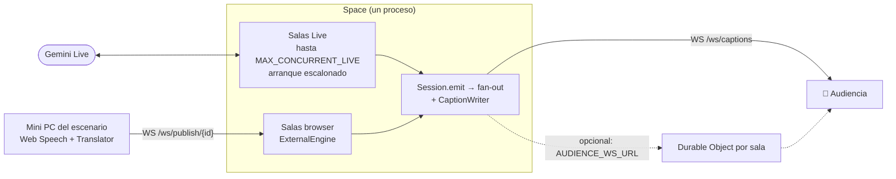

Opciones evaluadas en detalle: [`alternatives/TRANSCRIPTION-ENGINES.md`](alternatives/TRANSCRIPTION-ENGINES.md) (motores) y [`alternatives/CLOUD-EDGE.md`](alternatives/CLOUD-EDGE.md) (edge y hostings).

---

## 7. Decisiones

Una **DECISION PROVISIONAL** se puede revisar con nueva evidencia; una **DECISION** solo cambia con otra decisión explícita registrada acá.

### Decisiones vigentes

| # | Decisión | Estado | Por qué | Evidencia / revisar cuando |
|---|---|---|---|---|
| D0 | Motor: **Camino 1 — `live_translate`** (`ENGINE=live_translate`, `gemini-3.5-live-translate-preview`). Chunks REST quedan como fallback (`ENGINE=chunked`) | DECISION | Una sesión por sala da original + traducción; el Camino 2 suma traducción local de menor calidad | [Historial](#historial-la-decisión-de-h0) · T0.3 |
| D1 | `MAX_CONCURRENT_LIVE` es un **límite operativo de seguridad del backend**, no el límite de Gemini | DECISION | Google no publica un límite de sesiones Live concurrentes para este modelo (DOCUMENTED, ver reporte). El backend necesita un techo propio para no abrir sesiones que después salgan degradadas | — |
| D2 | Valor de `MAX_CONCURRENT_LIVE` = **2** | DECISION PROVISIONAL | Default conservador basado en T2.10a. El barrido parcial del 25/9 lo sostiene (N=2 en frío 6/6 aceptadas; N=3 no conectó en 2 de 3 trials), pero la medición tiene defectos | [Reporte §8](CONCURRENCY-REPORT.md#8-veredicto) · se cierra con T2.13 |
| D3 | Sin cupo, una sala **se rechaza** (`CapacityError` → 409); **nunca se encola** | DECISION | Una sala que "espera" en una conferencia es peor que un error claro para el operador: puede parar otra o subir el tope | `tests/test_capacity.py` |
| D4 | Se reserva el cupo **antes** de arrancar y se revierte si el arranque falla; la rotación y la reconexión de una sala usan su propio cupo | DECISION | Sin carreras (un solo event loop, sin `await` entre chequeo y reserva) ni cupos perdidos | `tests/test_capacity.py`, `tests/test_session.py` |
| D5 | Crear una sala ≠ arrancarla | DECISION | Se pueden preparar todas las salas del día; solo consumen Live las que arrancan | `SessionManager.create()` / `start()` |
| D6 | `SessionManager` sigue como componente de control + fan-out en esta fase | DECISION | Un proceso alcanza para la demo; el fan-out se mide aparte (`audience_load`) antes de cambiarlo | Prueba de audiencia (reporte §7) |
| D7 | Persistencia asíncrona: `CaptionWriter` con cola y disco en un hilo, **solo finales**, y un error de disco **no tira la sala** | DECISION | Todas las salas comparten el loop: un write bloqueante las frenaría a todas | `tests/test_session.py` (disco lento, disco roto, solo finales) |
| D8 | Instrumentar antes de optimizar: `LoopLagMonitor` como métrica primaria; los callbacks lentos del modo debug de asyncio son solo diagnóstico | DECISION | El lag del loop separa "Gemini está lento" de "nuestro proceso está bloqueado" | `tests/test_loop_monitor.py` |
| D9 | No optimizar todavía el `Segmenter`, `json.dumps` por cliente, ni limitar interims a 4/s | HYPOTHESIS (cada una) | Sin evidencia de que sean cuellos de botella: `dispatch_ms_max` ≈ 1 ms por mensaje. T2.19 deja listos JSON una vez por evento y `INTERIM_MAX_HZ` (default 0 = sin límite); el valor lo deciden la prueba de audiencia y el test E | Reporte [§7](CONCURRENCY-REPORT.md#7-prueba-de-audiencia-sin-gemini) y [§9](CONCURRENCY-REPORT.md#9-pendientes-y-próximos-experimentos) · T2.20 |
| D10 | Arranque escalonado **configurable**: cada apertura de conexión Live espera `LIVE_START_GAP_S` desde la anterior (default provisional 20 s) | DECISION PROVISIONAL | Protección ante la degradación de 3–7× observada en T2.10a al abrir sesiones cerca, que puede arruinar T2.10c. Stagger 5 s (A4-s5) no mostró ventaja: el valor se fija midiendo, no se asume | T2.18 · [reporte §6](CONCURRENCY-REPORT.md#6-barrido-2026-09-25) · se cierra con A4 s0/s20/s30 (T2.13) |
| D11 | Durable Objects de Cloudflare: **opción futura** para el fan-out a audiencias grandes, no ahora | DECISION | Resuelve coordinación, estado y fan-out distribuido. **No agrega cupo de Gemini** | [`alternatives/CLOUD-EDGE.md`](alternatives/CLOUD-EDGE.md) |
| D12 | El backend sigue en Python; **no** se migra a TypeScript/Cloudflare | DECISION | No resuelve el cuello de botella (el cupo de Gemini) y suma mucho riesgo en una hackathon | — |
| D13 | El motor híbrido Browser/Cloud es un **experimento**, no la arquitectura | EXPERIMENT | Las APIs del navegador tienen disponibilidad limitada (ver alternativas). Se implementa como motor por sala para las salas sin cupo Live | [`alternatives/TRANSCRIPTION-ENGINES.md`](alternatives/TRANSCRIPTION-ENGINES.md) · T2.14–T2.17 |
| D14 | La degradación de Live a browser es **manual, con un clic, nunca automática** | DECISION | El motor browser tiene menor calidad y disponibilidad limitada; un cambio automático puede oscilar y ocultar el error real. El operador decide con la información del panel | T2.17 |

### Decisiones descartadas y por qué

| Opción descartada | Por qué no |
|---|---|
| **Migrar todo a Cloudflare** (motor dentro de un Durable Object) | No agrega ni una sesión Live. Las conexiones **salientes** de un DO (la de Gemini) **no hibernan** (DOCUMENTED, Cloudflare, 2026-09-25). Obliga a portar a TS código que ya anda y tiene tests (runner, engine, segmenter, glosario, sesiones) |
| **Asumir 10 salas** (Live o "a $0") | No hay evidencia de más de 2 sesiones concurrentes estables. El objetivo se escala de a un paso (2 → 3 → …) y cada paso se justifica con un RESULT |
| **Subir `MAX_CONCURRENT_LIVE` sin pruebas** | En T2.10a, abrir sesiones cerca de otras degradó a una de ellas (3–7× más lenta) sin dar ningún error. En el barrido del 25/9, con 3 sesiones ninguna conectó en 2 de 3 trials. Un tope más alto sin medir puede producir salas que "andan" pero no subtitulan |
| **Depender solo de APIs del navegador** (Web Speech + Translator) | Web Speech en Chrome manda el audio a un servidor y no funciona offline. `processLocally` es nuevo y no está disponible en todos lados. La API no es Baseline (Firefox/Safari). Translator API: solo Chrome de escritorio, con descarga de modelo (DOCUMENTED, MDN y Chrome, 2026-09-25) |
| **Pool de API keys de varios proyectos propios** | Viola los términos de Google (prohíben eludir límites) y pueden suspender el proyecto |
| **Encolar salas cuando no hay cupo** | Ver D3 |
| **Chunks REST como motor principal** | ~480 requests por charla de 40 min: no entra en el free tier, y tiene un piso de latencia de ~4–8 s |

### Revisión de diseño: qué se adopta y qué se descarta

Resultado de revisar propuestas externas contra lo medido.

**Se descarta:**

| Propuesta | Por qué no |
|---|---|
| **`MediaRecorder` para capturar el audio** | Entrega contenedores (webm/opus) en trozos, no PCM16 a 16 kHz como pide Live; habría que decodificar en el servidor. Se usa AudioWorklet (T2.7) |
| **Chunks de audio por request** | ~480 requests por charla: no entra en el free tier, y la latencia es de ~4–8 s. Queda solo como fallback (`ENGINE=chunked`) |
| **Agrandar la ventana para no rotar** | La **conexión** se corta igual a los ~10 min (`GoAway` a los 9:00). La salida es rotar con reanudación y, para más de 15 min, `sliding_window` (T2.1, §4.6) |
| **Backend stateless para el motor** | La sesión Live es un WebSocket con estado (handle de reanudación, segmentadores, historial). Stateless solo aplica al fan-out (§6.4) |
| **Acumular la transcripción solo en memoria** | El disco del Space es efímero y el proceso se puede reiniciar en plena charla. Los finales van a `captions.jsonl` y se recargan al reiniciar (T2.3) |
| **Exportar al desconectar el escenario** | Una desconexión del browser del escenario no es el fin de la charla (se reconecta). Los exports salen de `captions.jsonl` al hacer Stop (T3.3) |
| **NotebookLM por HTTP** | No hay API pública para cuentas personales (§4.11). Queda el exporter no oficial (T3.9, P2) y el botón "Copiar para NotebookLM" |

**Se adapta o adopta:**

| Idea | Cómo entra | Tarea |
|---|---|---|
| Motor en el navegador | **Adaptada:** como motor por sala para las salas sin cupo Live, con degradación manual (D14), nunca como única vía | T2.14–T2.17 |
| Persistir el historial | **Adoptada:** recarga de los últimos finales desde `captions.jsonl` después de un reinicio | T2.3 |
| Fan-out y render eficientes | **Adoptada:** JSON una vez por evento, throttle opcional de interims, render incremental en la audiencia | T2.19, T2.21 |

### Historial: la decisión de H0

Contexto de D0, tal como se decidió al arrancar la hackathon.

**Alternativas evaluadas:**

| | A. Chunks REST (paso 1) | **B. Streaming Live (elegida)** | C. 100% local (Whisper + Gemma) |
|---|---|---|---|
| Latencia | ~4–8 s | parciales en ~0,5 s (medido, §3) | depende del hardware |
| Glosario | en el prompt | `custom_vocabulary` nativo o post-proceso | en el prompt |
| Cuota free tier | ~480 req/charla → no entra | ~5 sesiones/charla | sin cuota |
| Riesgo | bajo | límite de 10 min, cupo de sesiones | hardware, calidad del español |

**Presupuesto de requests por charla de 40 min:**

| Enfoque | Uso de API por charla | ¿Entra en free tier? |
|---|---|---|
| Chunks de 5 s (paso 1) | ~480 requests | No |
| transcribe-live + traducción por API frase a frase | ~5 sesiones + 400–800 requests | No |
| **Camino 1:** live-translate | ~5 sesiones (rotación c/ ~9 min) + 1–2 al final | Sí, si alcanza el cupo de sesiones |
| **Camino 2:** transcribe-live + traducción local | ~5 sesiones + 1–2 al final | Sí |

Snapshots de terceros reportaban límites muy bajos para modelos de texto en free tier (Gemini 3.5 Flash ≈ 5 RPM / 20 RPD; 3.1 Flash-Lite ≈ 15 RPM / 500 RPD), sin confirmar con la key real. Del paso 1 se reusaron `AudioSource`, `FileSource`, `normalize` y el CLI, con estos bugs arreglados: el productor y el consumidor del `FileSource` en el mismo loop (T1.1), el thinking por defecto de `gemini-2.5-flash`, el overlap de 0,75 s sin dedupe y el prompt contradictorio ("Rioplatense, neutral tone" → español neutro).

**Árbol de decisión** (T0.2 y T0.3):

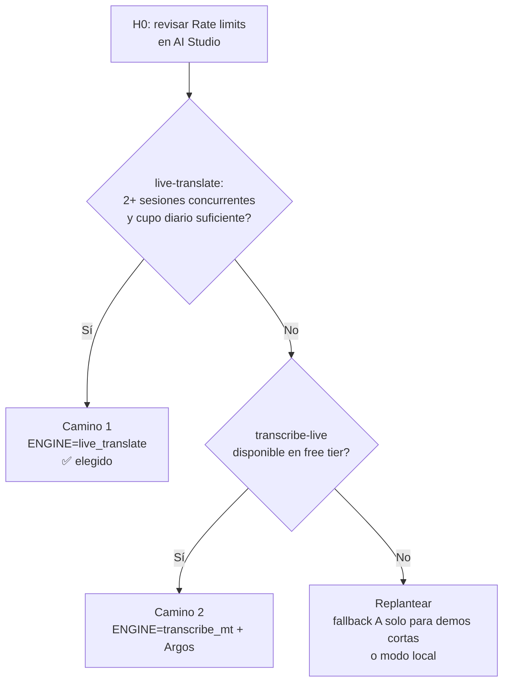

**Camino 1 — live-translate (elegido):** una sesión por sala entrega original + traducción; el idioma de la sala define el destino (charla en EN → `es`, en ES → `en`); `input_transcription` = original, `output_transcription` = traducción; glosario como post-proceso de reemplazo; trae el audio traducido de regalo (T3.8).

```python
config = types.LiveConnectConfig(
    response_modalities=["AUDIO"],
    input_audio_transcription=types.AudioTranscriptionConfig(),   # original
    output_audio_transcription=types.AudioTranscriptionConfig(),  # traducción
    translation_config=types.TranslationConfig(
        target_language_code="es" if sala.idioma == "en" else "en",
        echo_target_language=False,
    ),
)
```

**Camino 2 — transcribe-live + traducción local (no elegido):** transcripción con `custom_vocabulary` y modo `SMART`; traducción local en CPU con Argos Translate (MIT, modelos OPUS), protegiendo los términos del glosario con placeholders. Cero requests, menos calidad que un LLM.

```python
config = types.LiveConnectConfig(
    response_modalities=["TEXT"],
    input_audio_transcription=types.AudioTranscriptionConfig(
        language_codes=["en-US"],           # o ["es-419"] según la sala
        custom_vocabulary=glossary[:100],   # ≤100 términos rinde mejor
        mode="SMART",                       # comparar contra VERBATIM
    ),
)
# interim_input_transcription -> caption interim (gris, se reemplaza)
# input_transcription         -> caption final
```

---

## 8. Referencias

- Live transcription: <https://ai.google.dev/gemini-api/docs/live-api/live-transcribe>
- Live translation: <https://ai.google.dev/gemini-api/docs/live-api/live-translate>
- Session management (límites de sesión): <https://ai.google.dev/gemini-api/docs/live-api/session-management>
- Rate limits y tiers: <https://ai.google.dev/gemini-api/docs/rate-limits>
- Pricing (free tier y uso de datos): <https://ai.google.dev/gemini-api/docs/pricing>
- Ejemplos oficiales de Live API: <https://github.com/google-gemini/gemini-live-api-examples>
- Hugging Face Spaces: <https://huggingface.co/docs/hub/spaces-overview>
- notebooklm-py (no oficial): <https://github.com/teng-lin/notebooklm-py>
- Repo del equipo: <https://github.com/valentinnavalos/nerdearla-hackathon-2026>
